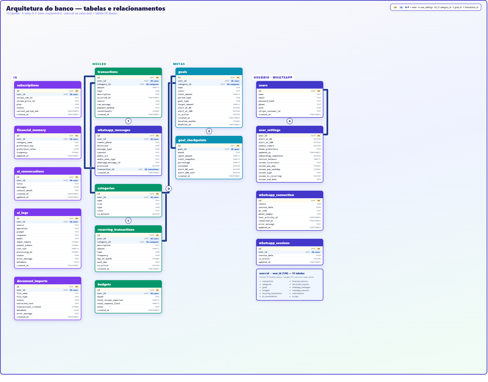
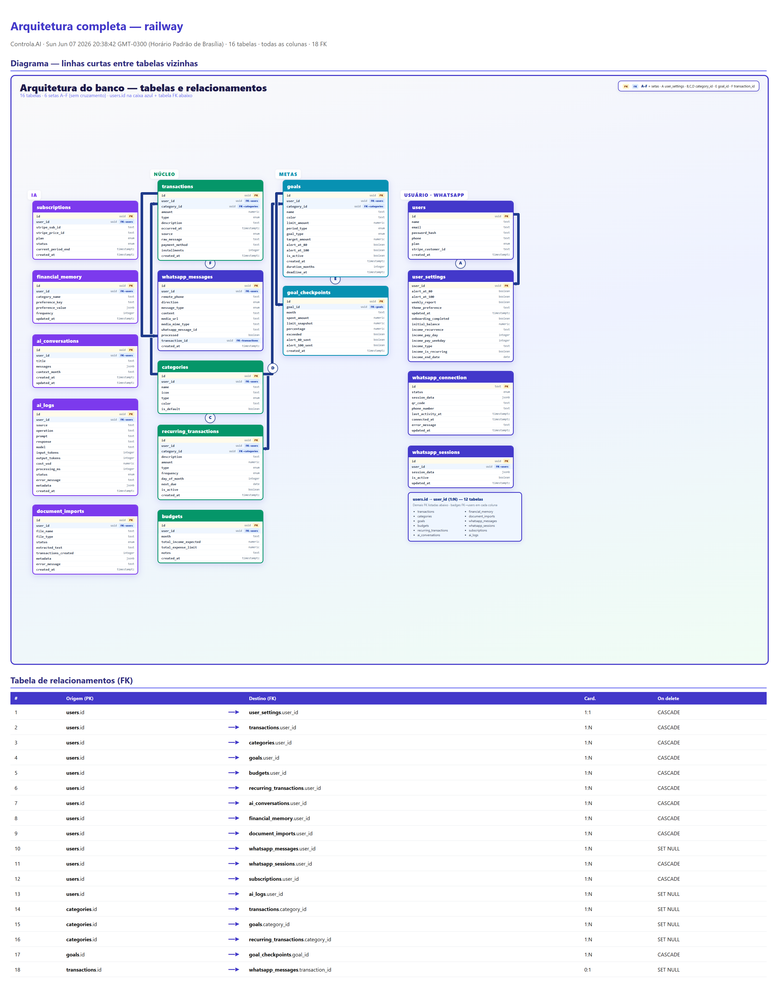

# Arquitetura completa do banco de dados — Controla.AI

> **PostgreSQL** · Banco: `railway` · 16 tabelas · Exportado: Sun Jun 07 2026 20:38:42 GMT-0300 (Horário Padrão de Brasília)

Diagramas PNG: [diagrama visual](./png/arquitetura-banco-diagrama.png) · [detalhes com conexões e colunas](./png/arquitetura-banco-detalhes.png)

---

## 1. Diagrama ER (Mermaid)

```mermaid
erDiagram
  users ||--|| user_settings : "user_id"
  users ||--o{ transactions : "user_id"
  users ||--o{ categories : "user_id"
  users ||--o{ goals : "user_id"
  users ||--o{ budgets : "user_id"
  users ||--o{ recurring_transactions : "user_id"
  users ||--o{ ai_conversations : "user_id"
  users ||--o{ financial_memory : "user_id"
  users ||--o{ document_imports : "user_id"
  users ||--o{ whatsapp_messages : "user_id"
  users ||--o{ whatsapp_sessions : "user_id"
  users ||--o{ subscriptions : "user_id"
  users ||--o{ ai_logs : "user_id"
  categories ||--o{ transactions : "category_id"
  categories ||--o{ goals : "category_id"
  categories ||--o{ recurring_transactions : "category_id"
  goals ||--o{ goal_checkpoints : "goal_id"
  transactions ||--o| whatsapp_messages : "transaction_id"
  ai_conversations {
    uuid id PK
    uuid user_id FK
    text title
    jsonb messages
    text context_month
    timestamp_with_time_zone created_at
    timestamp_with_time_zone updated_at
  }
  ai_logs {
    uuid id PK
    uuid user_id FK
    text source
    text operation
    text prompt
    text response
    text model
    integer input_tokens
    integer output_tokens
    numeric cost_usd
    integer processing_ms
    USER-DEFINED status
    text error_message
    jsonb metadata
    timestamp_with_time_zone created_at
  }
  budgets {
    uuid id PK
    uuid user_id FK
    text month
    numeric total_income_expected
    numeric total_expense_limit
    text notes
    timestamp_with_time_zone created_at
  }
  categories {
    uuid id PK
    uuid user_id FK
    text name
    text icon
    USER-DEFINED type
    text color
    boolean is_default
  }
  document_imports {
    uuid id PK
    uuid user_id FK
    text file_name
    text file_type
    USER-DEFINED status
    text extracted_text
    integer transactions_created
    jsonb metadata
    text error_message
    timestamp_with_time_zone created_at
  }
  financial_memory {
    uuid id PK
    uuid user_id FK
    text category_name
    text preference_key
    jsonb preference_value
    integer frequency
    timestamp_with_time_zone updated_at
  }
  goal_checkpoints {
    uuid id PK
    uuid goal_id FK
    text month
    numeric spent_amount
    numeric limit_snapshot
    numeric percentage
    boolean exceeded
    boolean alert_80_sent
    boolean alert_100_sent
    timestamp_with_time_zone created_at
  }
  goals {
    uuid id PK
    uuid user_id FK
    uuid category_id FK
    text name
    text color
    numeric limit_amount
    USER-DEFINED period_type
    USER-DEFINED goal_type
    numeric target_amount
    boolean alert_at_80
    boolean alert_at_100
    boolean is_active
    timestamp_with_time_zone created_at
    integer duration_months
    timestamp_with_time_zone deadline_at
  }
  recurring_transactions {
    uuid id PK
    uuid user_id FK
    uuid category_id FK
    text description
    numeric amount
    USER-DEFINED type
    USER-DEFINED frequency
    integer day_of_month
    date next_due
    boolean is_active
    timestamp_with_time_zone created_at
  }
  subscriptions {
    uuid id PK
    uuid user_id FK
    text stripe_sub_id FK
    text stripe_price_id FK
    USER-DEFINED plan
    USER-DEFINED status
    timestamp_with_time_zone current_period_end
    timestamp_with_time_zone created_at
  }
  transactions {
    uuid id PK
    uuid user_id FK
    uuid category_id FK
    numeric amount
    USER-DEFINED type
    text description
    timestamp_with_time_zone occurred_at
    USER-DEFINED source
    text raw_message
    text payment_method
    integer installments
    timestamp_with_time_zone created_at
  }
  user_settings {
    uuid user_id FK
    boolean alert_at_80
    boolean alert_at_100
    boolean weekly_report
    text theme_preference
    timestamp_with_time_zone updated_at
    boolean onboarding_completed
    numeric initial_balance
    text income_recurrence
    integer income_pay_day
    integer income_pay_weekday
    text income_type
    boolean income_is_recurring
    date income_end_date
  }
  users {
    uuid id PK
    text name
    text email
    text password_hash
    text phone
    USER-DEFINED plan
    text stripe_customer_id FK
    timestamp_with_time_zone created_at
  }
  whatsapp_connection {
    text id PK
    USER-DEFINED status
    jsonb session_data
    text qr_code
    text phone_number
    timestamp_with_time_zone last_activity_at
    timestamp_with_time_zone connected_at
    text error_message
    timestamp_with_time_zone updated_at
  }
  whatsapp_messages {
    uuid id PK
    uuid user_id FK
    text remote_phone
    USER-DEFINED direction
    USER-DEFINED message_type
    text content
    text media_url
    text media_mime_type
    text whatsapp_message_id FK
    boolean processed
    uuid transaction_id FK
    timestamp_with_time_zone created_at
  }
  whatsapp_sessions {
    uuid id PK
    uuid user_id FK
    jsonb session_data
    boolean is_active
    timestamp_with_time_zone updated_at
  }
```

---

## 2. Relacionamentos e chaves estrangeiras

| Origem | Coluna PK | → | Destino | Coluna FK | Cardinalidade |
|--------|-----------|---|---------|-----------|---------------|
| `users` | `id` | → | `user_settings` | `user_id` | 1:1 |
| `users` | `id` | → | `transactions` | `user_id` | 1:N |
| `users` | `id` | → | `categories` | `user_id` | 1:N |
| `users` | `id` | → | `goals` | `user_id` | 1:N |
| `users` | `id` | → | `budgets` | `user_id` | 1:N |
| `users` | `id` | → | `recurring_transactions` | `user_id` | 1:N |
| `users` | `id` | → | `ai_conversations` | `user_id` | 1:N |
| `users` | `id` | → | `financial_memory` | `user_id` | 1:N |
| `users` | `id` | → | `document_imports` | `user_id` | 1:N |
| `users` | `id` | → | `whatsapp_messages` | `user_id` | 1:N |
| `users` | `id` | → | `whatsapp_sessions` | `user_id` | 1:N |
| `users` | `id` | → | `subscriptions` | `user_id` | 1:N |
| `users` | `id` | → | `ai_logs` | `user_id` | 1:N |
| `categories` | `id` | → | `transactions` | `category_id` | 1:N |
| `categories` | `id` | → | `goals` | `category_id` | 1:N |
| `categories` | `id` | → | `recurring_transactions` | `category_id` | 1:N |
| `goals` | `id` | → | `goal_checkpoints` | `goal_id` | 1:N |
| `transactions` | `id` | → | `whatsapp_messages` | `transaction_id` | 0:1 |

---

## 3. Tabelas, colunas e chaves

### `ai_conversations`

| Coluna | Tipo | Null | Chave |
|--------|------|------|-------|
| `id` | uuid | NO | **PK** |
| `user_id` | uuid | NO | **FK** → `users.id` |
| `title` | text | YES |  |
| `messages` | jsonb | NO |  |
| `context_month` | text | YES |  |
| `created_at` | timestamp with time zone | NO |  |
| `updated_at` | timestamp with time zone | NO |  |

### `ai_logs`

| Coluna | Tipo | Null | Chave |
|--------|------|------|-------|
| `id` | uuid | NO | **PK** |
| `user_id` | uuid | YES | **FK** → `users.id` |
| `source` | text | NO |  |
| `operation` | text | NO |  |
| `prompt` | text | YES |  |
| `response` | text | YES |  |
| `model` | text | YES |  |
| `input_tokens` | integer | YES |  |
| `output_tokens` | integer | YES |  |
| `cost_usd` | numeric | YES |  |
| `processing_ms` | integer | YES |  |
| `status` | USER-DEFINED | NO |  |
| `error_message` | text | YES |  |
| `metadata` | jsonb | YES |  |
| `created_at` | timestamp with time zone | NO |  |

### `budgets`

| Coluna | Tipo | Null | Chave |
|--------|------|------|-------|
| `id` | uuid | NO | **PK** |
| `user_id` | uuid | NO | **FK** → `users.id` |
| `month` | text | NO |  |
| `total_income_expected` | numeric | YES |  |
| `total_expense_limit` | numeric | YES |  |
| `notes` | text | YES |  |
| `created_at` | timestamp with time zone | NO |  |

### `categories`

| Coluna | Tipo | Null | Chave |
|--------|------|------|-------|
| `id` | uuid | NO | **PK** |
| `user_id` | uuid | YES | **FK** → `users.id` |
| `name` | text | NO |  |
| `icon` | text | NO |  |
| `type` | USER-DEFINED | NO |  |
| `color` | text | NO |  |
| `is_default` | boolean | NO |  |

### `document_imports`

| Coluna | Tipo | Null | Chave |
|--------|------|------|-------|
| `id` | uuid | NO | **PK** |
| `user_id` | uuid | NO | **FK** → `users.id` |
| `file_name` | text | NO |  |
| `file_type` | text | NO |  |
| `status` | USER-DEFINED | NO |  |
| `extracted_text` | text | YES |  |
| `transactions_created` | integer | YES |  |
| `metadata` | jsonb | YES |  |
| `error_message` | text | YES |  |
| `created_at` | timestamp with time zone | NO |  |

### `financial_memory`

| Coluna | Tipo | Null | Chave |
|--------|------|------|-------|
| `id` | uuid | NO | **PK** |
| `user_id` | uuid | NO | **FK** → `users.id` |
| `category_name` | text | YES |  |
| `preference_key` | text | NO |  |
| `preference_value` | jsonb | NO |  |
| `frequency` | integer | NO |  |
| `updated_at` | timestamp with time zone | NO |  |

### `goal_checkpoints`

| Coluna | Tipo | Null | Chave |
|--------|------|------|-------|
| `id` | uuid | NO | **PK** |
| `goal_id` | uuid | NO | **FK** → `goals.id` |
| `month` | text | NO |  |
| `spent_amount` | numeric | NO |  |
| `limit_snapshot` | numeric | NO |  |
| `percentage` | numeric | NO |  |
| `exceeded` | boolean | NO |  |
| `alert_80_sent` | boolean | NO |  |
| `alert_100_sent` | boolean | NO |  |
| `created_at` | timestamp with time zone | NO |  |

### `goals`

| Coluna | Tipo | Null | Chave |
|--------|------|------|-------|
| `id` | uuid | NO | **PK** |
| `user_id` | uuid | NO | **FK** → `users.id` |
| `category_id` | uuid | YES | **FK** → `categories.id` |
| `name` | text | NO |  |
| `color` | text | NO |  |
| `limit_amount` | numeric | NO |  |
| `period_type` | USER-DEFINED | NO |  |
| `goal_type` | USER-DEFINED | NO |  |
| `target_amount` | numeric | YES |  |
| `alert_at_80` | boolean | NO |  |
| `alert_at_100` | boolean | NO |  |
| `is_active` | boolean | NO |  |
| `created_at` | timestamp with time zone | NO |  |
| `duration_months` | integer | YES |  |
| `deadline_at` | timestamp with time zone | YES |  |

### `recurring_transactions`

| Coluna | Tipo | Null | Chave |
|--------|------|------|-------|
| `id` | uuid | NO | **PK** |
| `user_id` | uuid | NO | **FK** → `users.id` |
| `category_id` | uuid | YES | **FK** → `categories.id` |
| `description` | text | NO |  |
| `amount` | numeric | NO |  |
| `type` | USER-DEFINED | NO |  |
| `frequency` | USER-DEFINED | NO |  |
| `day_of_month` | integer | NO |  |
| `next_due` | date | NO |  |
| `is_active` | boolean | NO |  |
| `created_at` | timestamp with time zone | NO |  |

### `subscriptions`

| Coluna | Tipo | Null | Chave |
|--------|------|------|-------|
| `id` | uuid | NO | **PK** |
| `user_id` | uuid | NO | **FK** → `users.id` |
| `stripe_sub_id` | text | YES |  |
| `stripe_price_id` | text | YES |  |
| `plan` | USER-DEFINED | NO |  |
| `status` | USER-DEFINED | NO |  |
| `current_period_end` | timestamp with time zone | YES |  |
| `created_at` | timestamp with time zone | NO |  |

### `transactions`

| Coluna | Tipo | Null | Chave |
|--------|------|------|-------|
| `id` | uuid | NO | **PK** |
| `user_id` | uuid | NO | **FK** → `users.id` |
| `category_id` | uuid | YES | **FK** → `categories.id` |
| `amount` | numeric | NO |  |
| `type` | USER-DEFINED | NO |  |
| `description` | text | YES |  |
| `occurred_at` | timestamp with time zone | NO |  |
| `source` | USER-DEFINED | NO |  |
| `raw_message` | text | YES |  |
| `payment_method` | text | YES |  |
| `installments` | integer | YES |  |
| `created_at` | timestamp with time zone | NO |  |

### `user_settings`

| Coluna | Tipo | Null | Chave |
|--------|------|------|-------|
| `user_id` | uuid | NO | **FK** → `users.id` |
| `alert_at_80` | boolean | NO |  |
| `alert_at_100` | boolean | NO |  |
| `weekly_report` | boolean | NO |  |
| `theme_preference` | text | NO |  |
| `updated_at` | timestamp with time zone | NO |  |
| `onboarding_completed` | boolean | NO |  |
| `initial_balance` | numeric | YES |  |
| `income_recurrence` | text | YES |  |
| `income_pay_day` | integer | YES |  |
| `income_pay_weekday` | integer | YES |  |
| `income_type` | text | YES |  |
| `income_is_recurring` | boolean | YES |  |
| `income_end_date` | date | YES |  |

### `users`

| Coluna | Tipo | Null | Chave |
|--------|------|------|-------|
| `id` | uuid | NO | **PK** |
| `name` | text | NO |  |
| `email` | text | NO |  |
| `password_hash` | text | NO |  |
| `phone` | text | YES |  |
| `plan` | USER-DEFINED | NO |  |
| `stripe_customer_id` | text | YES |  |
| `created_at` | timestamp with time zone | NO |  |

### `whatsapp_connection`

| Coluna | Tipo | Null | Chave |
|--------|------|------|-------|
| `id` | text | NO | **PK** |
| `status` | USER-DEFINED | NO |  |
| `session_data` | jsonb | YES |  |
| `qr_code` | text | YES |  |
| `phone_number` | text | YES |  |
| `last_activity_at` | timestamp with time zone | YES |  |
| `connected_at` | timestamp with time zone | YES |  |
| `error_message` | text | YES |  |
| `updated_at` | timestamp with time zone | NO |  |

### `whatsapp_messages`

| Coluna | Tipo | Null | Chave |
|--------|------|------|-------|
| `id` | uuid | NO | **PK** |
| `user_id` | uuid | YES | **FK** → `users.id` |
| `remote_phone` | text | NO |  |
| `direction` | USER-DEFINED | NO |  |
| `message_type` | USER-DEFINED | NO |  |
| `content` | text | YES |  |
| `media_url` | text | YES |  |
| `media_mime_type` | text | YES |  |
| `whatsapp_message_id` | text | YES |  |
| `processed` | boolean | NO |  |
| `transaction_id` | uuid | YES | **FK** → `transactions.id` |
| `created_at` | timestamp with time zone | NO |  |

### `whatsapp_sessions`

| Coluna | Tipo | Null | Chave |
|--------|------|------|-------|
| `id` | uuid | NO | **PK** |
| `user_id` | uuid | NO | **FK** → `users.id` |
| `session_data` | jsonb | NO |  |
| `is_active` | boolean | NO |  |
| `updated_at` | timestamp with time zone | NO |  |

---

## 4. Índice visual

