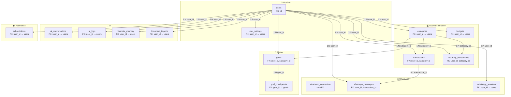

# Conexões do banco de dados — Controla.AI

> **PostgreSQL** · Banco: `railway` · 16 tabelas · 18 ligações (FK) · Exportado: Sun Jun 07 2026 20:38:42 GMT-0300 (Horário Padrão de Brasília)

Documento dedicado às **ligações entre tabelas**. Para colunas completas, ver [`ARQUITETURA_BANCO_COMPLETA.md`](./ARQUITETURA_BANCO_COMPLETA.md).

PNG visual: [diagrama](./png/arquitetura-banco-diagrama.png) · [detalhes](./png/arquitetura-banco-detalhes.png)

---

## Como ler este documento

| Símbolo | Significado |
|---------|-------------|
| **PK** | Chave primária — identifica cada linha da tabela |
| **FK** | Chave estrangeira — aponta para a PK de outra tabela |
| `1:1` | Um registro em A liga a **no máximo um** em B |
| `1:N` | Um registro em A liga a **vários** em B |
| `0:1` | Ligação **opcional** (FK pode ser NULL) |
| **CASCADE** | Ao apagar o pai, apaga os filhos |
| **SET NULL** | Ao apagar o pai, a FK do filho vira NULL |

**Regra geral:** quase tudo gira em torno de `users`. Apagar um usuário remove a maior parte dos dados dele.

---

## Mapa rápido — 16 tabelas em 6 grupos

```
                    ┌─────────────────────────────────────────┐
                    │              users (CENTRO)              │
                    └─────────────────────────────────────────┘
           ┌────────┬────────┬────────┬────────┬────────┬────────┐
           │        │        │        │        │        │        │
     user_settings  │   categories ──► transactions ◄── whatsapp_messages
           │        │        │              ▲                    │
      budgets │      │        └──► goals ──► goal_checkpoints     │
           │        │        │              │                    │
  recurring_tx │     │        └──► (category_id em 3 tabelas)     │
           │        │        │                                   │
  ai_conversations  financial_memory  document_imports  ai_logs   │
  whatsapp_sessions  subscriptions                         transaction_id
           │                                                        │
  whatsapp_connection (isolada — sem FK para users)               │
```

---

## Diagrama de conexões (Mermaid)



---

## Lista completa das 18 conexões (FK)

| # | De (PK) | Coluna FK | Para (tabela) | Card. | Ao apagar pai |
|---|---------|-----------|---------------|-------|---------------|
| 1 | `users.id` | `user_settings.user_id` | `user_settings` | 1:1 | CASCADE |
| 2 | `users.id` | `transactions.user_id` | `transactions` | 1:N | CASCADE |
| 3 | `users.id` | `categories.user_id` | `categories` | 1:N | CASCADE |
| 4 | `users.id` | `goals.user_id` | `goals` | 1:N | CASCADE |
| 5 | `users.id` | `budgets.user_id` | `budgets` | 1:N | CASCADE |
| 6 | `users.id` | `recurring_transactions.user_id` | `recurring_transactions` | 1:N | CASCADE |
| 7 | `users.id` | `ai_conversations.user_id` | `ai_conversations` | 1:N | CASCADE |
| 8 | `users.id` | `financial_memory.user_id` | `financial_memory` | 1:N | CASCADE |
| 9 | `users.id` | `document_imports.user_id` | `document_imports` | 1:N | CASCADE |
| 10 | `users.id` | `whatsapp_messages.user_id` | `whatsapp_messages` | 1:N | SET NULL |
| 11 | `users.id` | `whatsapp_sessions.user_id` | `whatsapp_sessions` | 1:N | CASCADE |
| 12 | `users.id` | `subscriptions.user_id` | `subscriptions` | 1:N | CASCADE |
| 13 | `users.id` | `ai_logs.user_id` | `ai_logs` | 1:N | SET NULL |
| 14 | `categories.id` | `transactions.category_id` | `transactions` | 1:N | SET NULL |
| 15 | `categories.id` | `goals.category_id` | `goals` | 1:N | SET NULL |
| 16 | `categories.id` | `recurring_transactions.category_id` | `recurring_transactions` | 1:N | SET NULL |
| 17 | `goals.id` | `goal_checkpoints.goal_id` | `goal_checkpoints` | 1:N | CASCADE |
| 18 | `transactions.id` | `whatsapp_messages.transaction_id` | `whatsapp_messages` | 0:1 | SET NULL |

---

## Conexões por domínio

### IA

**Tabelas:** `ai_conversations`, `ai_logs`, `document_imports`, `financial_memory`

| Ligação | Explicação |
|---------|------------|
| `users.id` → `ai_conversations.user_id` | Cada `users` pode ter vários registros em `ai_conversations`. Ao apagar `users`: **CASCADE**. |
| `users.id` → `financial_memory.user_id` | Cada `users` pode ter vários registros em `financial_memory`. Ao apagar `users`: **CASCADE**. |
| `users.id` → `document_imports.user_id` | Cada `users` pode ter vários registros em `document_imports`. Ao apagar `users`: **CASCADE**. |
| `users.id` → `ai_logs.user_id` | Cada `users` pode ter vários registros em `ai_logs`. Ao apagar `users`: **SET NULL**. |

### Núcleo financeiro

**Tabelas:** `budgets`, `categories`, `recurring_transactions`, `transactions`

| Ligação | Explicação |
|---------|------------|
| `users.id` → `transactions.user_id` | Cada `users` pode ter vários registros em `transactions`. Ao apagar `users`: **CASCADE**. |
| `users.id` → `categories.user_id` | Cada `users` pode ter vários registros em `categories`. Ao apagar `users`: **CASCADE**. |
| `users.id` → `budgets.user_id` | Cada `users` pode ter vários registros em `budgets`. Ao apagar `users`: **CASCADE**. |
| `users.id` → `recurring_transactions.user_id` | Cada `users` pode ter vários registros em `recurring_transactions`. Ao apagar `users`: **CASCADE**. |
| `categories.id` → `transactions.category_id` | Cada `categories` pode ter vários registros em `transactions`. Ao apagar `categories`: **SET NULL**. |
| `categories.id` → `goals.category_id` | Cada `categories` pode ter vários registros em `goals`. Ao apagar `categories`: **SET NULL**. |
| `categories.id` → `recurring_transactions.category_id` | Cada `categories` pode ter vários registros em `recurring_transactions`. Ao apagar `categories`: **SET NULL**. |
| `transactions.id` → `whatsapp_messages.transaction_id` | Ligação opcional — a mensagem pode ou não ter transação vinculada. Ao apagar `transactions`: **SET NULL**. |

### Metas

**Tabelas:** `goal_checkpoints`, `goals`

| Ligação | Explicação |
|---------|------------|
| `users.id` → `goals.user_id` | Cada `users` pode ter vários registros em `goals`. Ao apagar `users`: **CASCADE**. |
| `categories.id` → `goals.category_id` | Cada `categories` pode ter vários registros em `goals`. Ao apagar `categories`: **SET NULL**. |
| `goals.id` → `goal_checkpoints.goal_id` | Cada `goals` pode ter vários registros em `goal_checkpoints`. Ao apagar `goals`: **CASCADE**. |

### Assinatura

**Tabelas:** `subscriptions`

| Ligação | Explicação |
|---------|------------|
| `users.id` → `subscriptions.user_id` | Cada `users` pode ter vários registros em `subscriptions`. Ao apagar `users`: **CASCADE**. |

### Usuário

**Tabelas:** `user_settings`, `users`

| Ligação | Explicação |
|---------|------------|
| `users.id` → `user_settings.user_id` | Um usuário tem no máximo um registro de configurações. Ao apagar `users`: **CASCADE**. |
| `users.id` → `transactions.user_id` | Cada `users` pode ter vários registros em `transactions`. Ao apagar `users`: **CASCADE**. |
| `users.id` → `categories.user_id` | Cada `users` pode ter vários registros em `categories`. Ao apagar `users`: **CASCADE**. |
| `users.id` → `goals.user_id` | Cada `users` pode ter vários registros em `goals`. Ao apagar `users`: **CASCADE**. |
| `users.id` → `budgets.user_id` | Cada `users` pode ter vários registros em `budgets`. Ao apagar `users`: **CASCADE**. |
| `users.id` → `recurring_transactions.user_id` | Cada `users` pode ter vários registros em `recurring_transactions`. Ao apagar `users`: **CASCADE**. |
| `users.id` → `ai_conversations.user_id` | Cada `users` pode ter vários registros em `ai_conversations`. Ao apagar `users`: **CASCADE**. |
| `users.id` → `financial_memory.user_id` | Cada `users` pode ter vários registros em `financial_memory`. Ao apagar `users`: **CASCADE**. |
| `users.id` → `document_imports.user_id` | Cada `users` pode ter vários registros em `document_imports`. Ao apagar `users`: **CASCADE**. |
| `users.id` → `whatsapp_messages.user_id` | Cada `users` pode ter vários registros em `whatsapp_messages`. Ao apagar `users`: **SET NULL**. |
| `users.id` → `whatsapp_sessions.user_id` | Cada `users` pode ter vários registros em `whatsapp_sessions`. Ao apagar `users`: **CASCADE**. |
| `users.id` → `subscriptions.user_id` | Cada `users` pode ter vários registros em `subscriptions`. Ao apagar `users`: **CASCADE**. |
| `users.id` → `ai_logs.user_id` | Cada `users` pode ter vários registros em `ai_logs`. Ao apagar `users`: **SET NULL**. |

### WhatsApp

**Tabelas:** `whatsapp_connection`, `whatsapp_messages`, `whatsapp_sessions`

| Ligação | Explicação |
|---------|------------|
| `users.id` → `whatsapp_messages.user_id` | Cada `users` pode ter vários registros em `whatsapp_messages`. Ao apagar `users`: **SET NULL**. |
| `users.id` → `whatsapp_sessions.user_id` | Cada `users` pode ter vários registros em `whatsapp_sessions`. Ao apagar `users`: **CASCADE**. |
| `transactions.id` → `whatsapp_messages.transaction_id` | Ligação opcional — a mensagem pode ou não ter transação vinculada. Ao apagar `transactions`: **SET NULL**. |

---

## Cada tabela — entradas e saídas

Para cada tabela: **quem aponta para ela** (entrada) e **para quem ela aponta** (saída).

### `ai_conversations`

- **Domínio:** IA
- **Papel:** Histórico do chat web com a IA.
- **Colunas:** 7 (detalhes em [ARQUITETURA_BANCO_COMPLETA.md](./ARQUITETURA_BANCO_COMPLETA.md))

**Entradas** (outras tabelas apontam para esta):

- `users.id` → `user_id` (1:N, CASCADE)

**Saídas** (esta tabela aponta para outras):

- _Nenhuma FK de saída._

**Colunas FK nesta tabela:**

| Coluna | Referencia | Nullable |
|--------|------------|----------|
| `user_id` | `users.id` | NO |

### `ai_logs`

- **Domínio:** IA
- **Papel:** Log de chamadas OpenAI (parser, agente, etc.).
- **Colunas:** 15 (detalhes em [ARQUITETURA_BANCO_COMPLETA.md](./ARQUITETURA_BANCO_COMPLETA.md))

**Entradas** (outras tabelas apontam para esta):

- `users.id` → `user_id` (1:N, SET NULL)

**Saídas** (esta tabela aponta para outras):

- _Nenhuma FK de saída._

**Colunas FK nesta tabela:**

| Coluna | Referencia | Nullable |
|--------|------------|----------|
| `user_id` | `users.id` | YES |

### `budgets`

- **Domínio:** Núcleo financeiro
- **Papel:** Orçamento mensal (renda esperada, limite de gastos).
- **Colunas:** 7 (detalhes em [ARQUITETURA_BANCO_COMPLETA.md](./ARQUITETURA_BANCO_COMPLETA.md))

**Entradas** (outras tabelas apontam para esta):

- `users.id` → `user_id` (1:N, CASCADE)

**Saídas** (esta tabela aponta para outras):

- _Nenhuma FK de saída._

**Colunas FK nesta tabela:**

| Coluna | Referencia | Nullable |
|--------|------------|----------|
| `user_id` | `users.id` | NO |

### `categories`

- **Domínio:** Núcleo financeiro
- **Papel:** Categorias de receita/despesa (padrão ou personalizadas).
- **Colunas:** 7 (detalhes em [ARQUITETURA_BANCO_COMPLETA.md](./ARQUITETURA_BANCO_COMPLETA.md))

**Entradas** (outras tabelas apontam para esta):

- `users.id` → `user_id` (1:N, CASCADE)

**Saídas** (esta tabela aponta para outras):

- `category_id` → `categories.id` (1:N, SET NULL)
- `category_id` → `categories.id` (1:N, SET NULL)
- `category_id` → `categories.id` (1:N, SET NULL)

**Colunas FK nesta tabela:**

| Coluna | Referencia | Nullable |
|--------|------------|----------|
| `user_id` | `users.id` | YES |

### `document_imports`

- **Domínio:** IA
- **Papel:** Importação de PDFs/extratos pelo painel.
- **Colunas:** 10 (detalhes em [ARQUITETURA_BANCO_COMPLETA.md](./ARQUITETURA_BANCO_COMPLETA.md))

**Entradas** (outras tabelas apontam para esta):

- `users.id` → `user_id` (1:N, CASCADE)

**Saídas** (esta tabela aponta para outras):

- _Nenhuma FK de saída._

**Colunas FK nesta tabela:**

| Coluna | Referencia | Nullable |
|--------|------------|----------|
| `user_id` | `users.id` | NO |

### `financial_memory`

- **Domínio:** IA
- **Papel:** Preferências aprendidas pela IA (JSON por chave).
- **Colunas:** 7 (detalhes em [ARQUITETURA_BANCO_COMPLETA.md](./ARQUITETURA_BANCO_COMPLETA.md))

**Entradas** (outras tabelas apontam para esta):

- `users.id` → `user_id` (1:N, CASCADE)

**Saídas** (esta tabela aponta para outras):

- _Nenhuma FK de saída._

**Colunas FK nesta tabela:**

| Coluna | Referencia | Nullable |
|--------|------------|----------|
| `user_id` | `users.id` | NO |

### `goal_checkpoints`

- **Domínio:** Metas
- **Papel:** Histórico mensal de progresso de cada meta.
- **Colunas:** 10 (detalhes em [ARQUITETURA_BANCO_COMPLETA.md](./ARQUITETURA_BANCO_COMPLETA.md))

**Entradas** (outras tabelas apontam para esta):

- `goals.id` → `goal_id` (1:N, CASCADE)

**Saídas** (esta tabela aponta para outras):

- _Nenhuma FK de saída._

**Colunas FK nesta tabela:**

| Coluna | Referencia | Nullable |
|--------|------------|----------|
| `goal_id` | `goals.id` | NO |

### `goals`

- **Domínio:** Metas
- **Papel:** Metas financeiras (teto de gasto ou poupança).
- **Colunas:** 15 (detalhes em [ARQUITETURA_BANCO_COMPLETA.md](./ARQUITETURA_BANCO_COMPLETA.md))

**Entradas** (outras tabelas apontam para esta):

- `users.id` → `user_id` (1:N, CASCADE)
- `categories.id` → `category_id` (1:N, SET NULL)

**Saídas** (esta tabela aponta para outras):

- `goal_id` → `goals.id` (1:N, CASCADE)

**Colunas FK nesta tabela:**

| Coluna | Referencia | Nullable |
|--------|------------|----------|
| `user_id` | `users.id` | NO |
| `category_id` | `categories.id` | YES |

### `recurring_transactions`

- **Domínio:** Núcleo financeiro
- **Papel:** Despesas/receitas fixas com vencimento recorrente.
- **Colunas:** 11 (detalhes em [ARQUITETURA_BANCO_COMPLETA.md](./ARQUITETURA_BANCO_COMPLETA.md))

**Entradas** (outras tabelas apontam para esta):

- `users.id` → `user_id` (1:N, CASCADE)
- `categories.id` → `category_id` (1:N, SET NULL)

**Saídas** (esta tabela aponta para outras):

- _Nenhuma FK de saída._

**Colunas FK nesta tabela:**

| Coluna | Referencia | Nullable |
|--------|------------|----------|
| `user_id` | `users.id` | NO |
| `category_id` | `categories.id` | YES |

### `subscriptions`

- **Domínio:** Assinatura
- **Papel:** Assinatura Stripe (plano pago).
- **Colunas:** 8 (detalhes em [ARQUITETURA_BANCO_COMPLETA.md](./ARQUITETURA_BANCO_COMPLETA.md))

**Entradas** (outras tabelas apontam para esta):

- `users.id` → `user_id` (1:N, CASCADE)

**Saídas** (esta tabela aponta para outras):

- _Nenhuma FK de saída._

**Colunas FK nesta tabela:**

| Coluna | Referencia | Nullable |
|--------|------------|----------|
| `user_id` | `users.id` | NO |
| `stripe_sub_id` | — | YES |
| `stripe_price_id` | — | YES |

### `transactions`

- **Domínio:** Núcleo financeiro
- **Papel:** Lançamentos financeiros (gastos e receitas).
- **Colunas:** 12 (detalhes em [ARQUITETURA_BANCO_COMPLETA.md](./ARQUITETURA_BANCO_COMPLETA.md))

**Entradas** (outras tabelas apontam para esta):

- `users.id` → `user_id` (1:N, CASCADE)
- `categories.id` → `category_id` (1:N, SET NULL)

**Saídas** (esta tabela aponta para outras):

- `transaction_id` → `transactions.id` (0:1, SET NULL)

**Colunas FK nesta tabela:**

| Coluna | Referencia | Nullable |
|--------|------------|----------|
| `user_id` | `users.id` | NO |
| `category_id` | `categories.id` | YES |

### `user_settings`

- **Domínio:** Usuário
- **Papel:** Preferências e onboarding do usuário (1 registro por usuário).
- **Colunas:** 14 (detalhes em [ARQUITETURA_BANCO_COMPLETA.md](./ARQUITETURA_BANCO_COMPLETA.md))

**Entradas** (outras tabelas apontam para esta):

- `users.id` → `user_id` (1:1, CASCADE)

**Saídas** (esta tabela aponta para outras):

- _Nenhuma FK de saída._

**Colunas FK nesta tabela:**

| Coluna | Referencia | Nullable |
|--------|------------|----------|
| `user_id` | `users.id` | NO |

### `users`

- **Domínio:** Usuário
- **Papel:** Conta do sistema (login web + vínculo WhatsApp). **Tabela central** — quase tudo depende dela.
- **Colunas:** 8 (detalhes em [ARQUITETURA_BANCO_COMPLETA.md](./ARQUITETURA_BANCO_COMPLETA.md))

**Entradas** (outras tabelas apontam para esta):

- _Nenhuma — esta tabela é raiz ou isolada._

**Saídas** (esta tabela aponta para outras):

- `user_id` → `users.id` (1:1, CASCADE)
- `user_id` → `users.id` (1:N, CASCADE)
- `user_id` → `users.id` (1:N, CASCADE)
- `user_id` → `users.id` (1:N, CASCADE)
- `user_id` → `users.id` (1:N, CASCADE)
- `user_id` → `users.id` (1:N, CASCADE)
- `user_id` → `users.id` (1:N, CASCADE)
- `user_id` → `users.id` (1:N, CASCADE)
- `user_id` → `users.id` (1:N, CASCADE)
- `user_id` → `users.id` (1:N, SET NULL)
- `user_id` → `users.id` (1:N, CASCADE)
- `user_id` → `users.id` (1:N, CASCADE)
- `user_id` → `users.id` (1:N, SET NULL)

**Colunas FK nesta tabela:**

| Coluna | Referencia | Nullable |
|--------|------------|----------|
| `stripe_customer_id` | — | YES |

### `whatsapp_connection`

- **Domínio:** WhatsApp
- **Papel:** Estado global da conexão Baileys (singleton `main`). **Sem FK** — não liga a `users`.
- **Colunas:** 9 (detalhes em [ARQUITETURA_BANCO_COMPLETA.md](./ARQUITETURA_BANCO_COMPLETA.md))

**Entradas** (outras tabelas apontam para esta):

- _Nenhuma — esta tabela é raiz ou isolada._

**Saídas** (esta tabela aponta para outras):

- _Nenhuma FK de saída._

### `whatsapp_messages`

- **Domínio:** WhatsApp
- **Papel:** Mensagens recebidas/enviadas pelo WhatsApp.
- **Colunas:** 12 (detalhes em [ARQUITETURA_BANCO_COMPLETA.md](./ARQUITETURA_BANCO_COMPLETA.md))

**Entradas** (outras tabelas apontam para esta):

- `users.id` → `user_id` (1:N, SET NULL)
- `transactions.id` → `transaction_id` (0:1, SET NULL)

**Saídas** (esta tabela aponta para outras):

- _Nenhuma FK de saída._

**Colunas FK nesta tabela:**

| Coluna | Referencia | Nullable |
|--------|------------|----------|
| `user_id` | `users.id` | YES |
| `whatsapp_message_id` | — | YES |
| `transaction_id` | `transactions.id` | YES |

### `whatsapp_sessions`

- **Domínio:** WhatsApp
- **Papel:** Sessão Baileys por usuário (credenciais criptografadas).
- **Colunas:** 5 (detalhes em [ARQUITETURA_BANCO_COMPLETA.md](./ARQUITETURA_BANCO_COMPLETA.md))

**Entradas** (outras tabelas apontam para esta):

- `users.id` → `user_id` (1:N, CASCADE)

**Saídas** (esta tabela aponta para outras):

- _Nenhuma FK de saída._

**Colunas FK nesta tabela:**

| Coluna | Referencia | Nullable |
|--------|------------|----------|
| `user_id` | `users.id` | NO |

---

## Cadeias de dados importantes

### WhatsApp → transação

```
whatsapp_messages.user_id ──► users.id
whatsapp_messages.transaction_id ──► transactions.id (opcional)
transactions.user_id ──► users.id
transactions.category_id ──► categories.id (opcional)
```

Fluxo: mensagem chega → IA parseia → cria `transactions` → preenche `whatsapp_messages.transaction_id`.

### Meta com checkpoints

```
users.id ◄── goals.user_id
categories.id ◄── goals.category_id (opcional)
goals.id ◄── goal_checkpoints.goal_id
```

Cada meta gera registros mensais em `goal_checkpoints` (gasto vs limite).

### Categoria compartilhada

```
categories.id ◄── transactions.category_id
categories.id ◄── goals.category_id
categories.id ◄── recurring_transactions.category_id
```

Uma categoria pode classificar lançamentos, metas e recorrentes do mesmo usuário.

### Tabela isolada

`whatsapp_connection` guarda QR, status e sessão **global** do bot. Não tem `user_id` — é um singleton (`id = 'main'`).

---

## Diagrama ER compacto (Mermaid)

```mermaid
erDiagram
  users ||--|| user_settings : "user_id"
  users ||--o{ transactions : "user_id"
  users ||--o{ categories : "user_id"
  users ||--o{ goals : "user_id"
  users ||--o{ budgets : "user_id"
  users ||--o{ recurring_transactions : "user_id"
  users ||--o{ ai_conversations : "user_id"
  users ||--o{ financial_memory : "user_id"
  users ||--o{ document_imports : "user_id"
  users ||--o{ whatsapp_messages : "user_id"
  users ||--o{ whatsapp_sessions : "user_id"
  users ||--o{ subscriptions : "user_id"
  users ||--o{ ai_logs : "user_id"
  categories ||--o{ transactions : "category_id"
  categories ||--o{ goals : "category_id"
  categories ||--o{ recurring_transactions : "category_id"
  goals ||--o{ goal_checkpoints : "goal_id"
  transactions ||--o| whatsapp_messages : "transaction_id"
  ai_conversations {
    uuid id PK
    uuid user_id FK
    text title
    jsonb messages
    text context_month
    timestamp_with_time_zone created_at
    timestamp_with_time_zone updated_at
  }
  ai_logs {
    uuid id PK
    uuid user_id FK
    text source
    text operation
    text prompt
    text response
    text model
    integer input_tokens
    integer output_tokens
    numeric cost_usd
    integer processing_ms
    USER-DEFINED status
    text error_message
    jsonb metadata
    timestamp_with_time_zone created_at
  }
  budgets {
    uuid id PK
    uuid user_id FK
    text month
    numeric total_income_expected
    numeric total_expense_limit
    text notes
    timestamp_with_time_zone created_at
  }
  categories {
    uuid id PK
    uuid user_id FK
    text name
    text icon
    USER-DEFINED type
    text color
    boolean is_default
  }
  document_imports {
    uuid id PK
    uuid user_id FK
    text file_name
    text file_type
    USER-DEFINED status
    text extracted_text
    integer transactions_created
    jsonb metadata
    text error_message
    timestamp_with_time_zone created_at
  }
  financial_memory {
    uuid id PK
    uuid user_id FK
    text category_name
    text preference_key
    jsonb preference_value
    integer frequency
    timestamp_with_time_zone updated_at
  }
  goal_checkpoints {
    uuid id PK
    uuid goal_id FK
    text month
    numeric spent_amount
    numeric limit_snapshot
    numeric percentage
    boolean exceeded
    boolean alert_80_sent
    boolean alert_100_sent
    timestamp_with_time_zone created_at
  }
  goals {
    uuid id PK
    uuid user_id FK
    uuid category_id FK
    text name
    text color
    numeric limit_amount
    USER-DEFINED period_type
    USER-DEFINED goal_type
    numeric target_amount
    boolean alert_at_80
    boolean alert_at_100
    boolean is_active
    timestamp_with_time_zone created_at
    integer duration_months
    timestamp_with_time_zone deadline_at
  }
  recurring_transactions {
    uuid id PK
    uuid user_id FK
    uuid category_id FK
    text description
    numeric amount
    USER-DEFINED type
    USER-DEFINED frequency
    integer day_of_month
    date next_due
    boolean is_active
    timestamp_with_time_zone created_at
  }
  subscriptions {
    uuid id PK
    uuid user_id FK
    text stripe_sub_id FK
    text stripe_price_id FK
    USER-DEFINED plan
    USER-DEFINED status
    timestamp_with_time_zone current_period_end
    timestamp_with_time_zone created_at
  }
  transactions {
    uuid id PK
    uuid user_id FK
    uuid category_id FK
    numeric amount
    USER-DEFINED type
    text description
    timestamp_with_time_zone occurred_at
    USER-DEFINED source
    text raw_message
    text payment_method
    integer installments
    timestamp_with_time_zone created_at
  }
  user_settings {
    uuid user_id FK
    boolean alert_at_80
    boolean alert_at_100
    boolean weekly_report
    text theme_preference
    timestamp_with_time_zone updated_at
    boolean onboarding_completed
    numeric initial_balance
    text income_recurrence
    integer income_pay_day
    integer income_pay_weekday
    text income_type
    boolean income_is_recurring
    date income_end_date
  }
  users {
    uuid id PK
    text name
    text email
    text password_hash
    text phone
    USER-DEFINED plan
    text stripe_customer_id FK
    timestamp_with_time_zone created_at
  }
  whatsapp_connection {
    text id PK
    USER-DEFINED status
    jsonb session_data
    text qr_code
    text phone_number
    timestamp_with_time_zone last_activity_at
    timestamp_with_time_zone connected_at
    text error_message
    timestamp_with_time_zone updated_at
  }
  whatsapp_messages {
    uuid id PK
    uuid user_id FK
    text remote_phone
    USER-DEFINED direction
    USER-DEFINED message_type
    text content
    text media_url
    text media_mime_type
    text whatsapp_message_id FK
    boolean processed
    uuid transaction_id FK
    timestamp_with_time_zone created_at
  }
  whatsapp_sessions {
    uuid id PK
    uuid user_id FK
    jsonb session_data
    boolean is_active
    timestamp_with_time_zone updated_at
  }
```



---

## Índice visual


