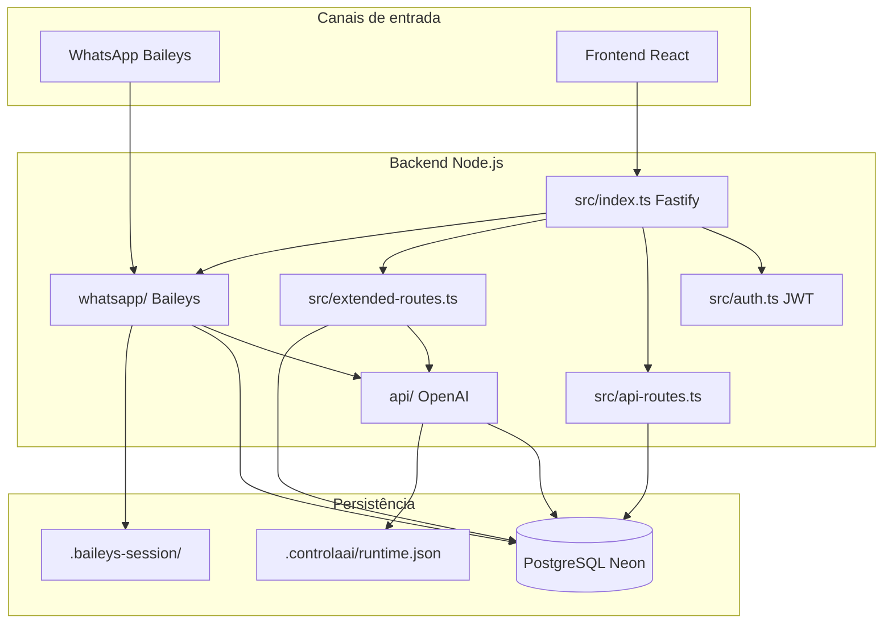
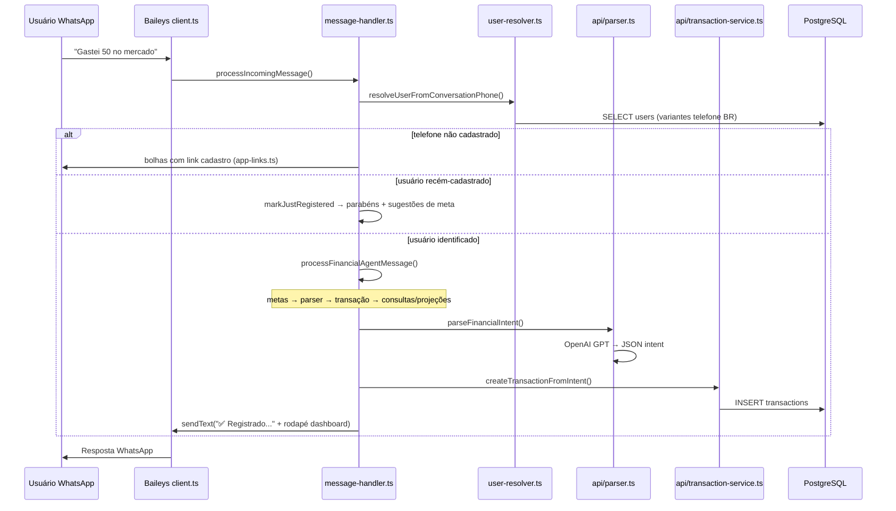
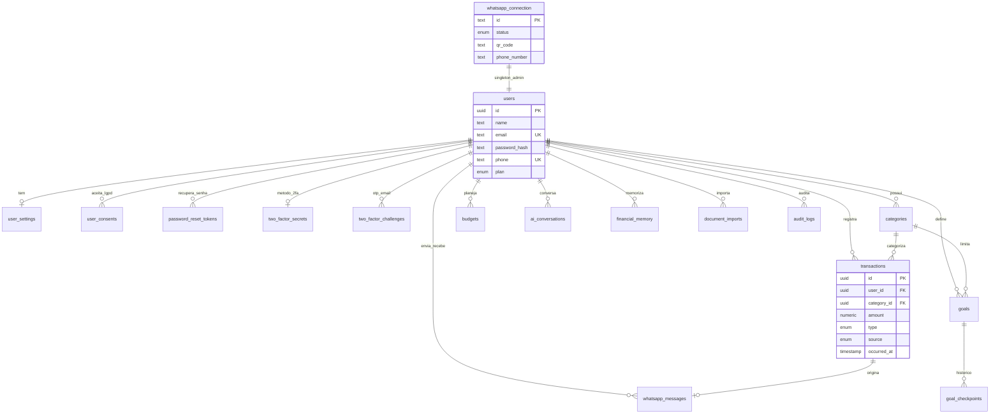
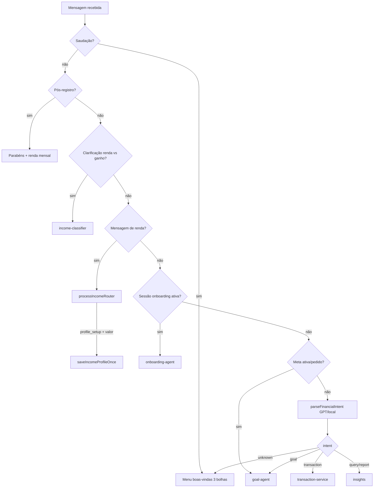

# Controla.AI — Documentação TCC

> **Documento único e oficial** do Trabalho de Conclusão de Curso.  
> Descreve arquitetura, lógica de negócio, banco de dados e fluxos do sistema.  
> **Regra de manutenção:** qualquer alteração de código, schema, rotas ou pastas **deve ser refletida aqui** na mesma entrega.

**Versão:** 8.16 · **Última revisão:** ago/2026 · **Repositório:** Controla.AI

---

## Guia rápido — Onde está cada módulo

| Módulo | Pasta / arquivos principais |
|--------|----------------------------|
| **Autenticação (JWT, reset, 2FA e-mail)** | `backend/src/auth.ts`, `backend/src/mailer.ts` — login/registro, OTP, `password_reset_tokens` |
| **Governança (auditoria, LGPD, níveis)** | `backend/src/governance-routes.ts`, `audit.ts`, `lgpd.ts` — `audit_logs`, `lgpd_sensitive_fields` |
| **Integração WhatsApp (Baileys)** | `backend/whatsapp/` — `client.ts`, `message-handler.ts`, `whatsapp-bubbles.ts`, `user-resolver.ts`, `routes.ts` |
| **Consultas financeiras** | `backend/api/insights.ts` — respostas a "quanto gastei?", projeções, relatórios e KPIs |
| **Integração IA com Baileys** | `backend/whatsapp/message-handler.ts` → `backend/api/financial-agent.ts`, `parser.ts`, `openai-client.ts`, `media-processor.ts` |

**Arquitetura do banco (MD + PNG):** [`documentacao-tcc/CONEXOES_BANCO_DADOS.md`](documentacao-tcc/CONEXOES_BANCO_DADOS.md) (ligações claras) · [`ARQUITETURA_BANCO_COMPLETA.md`](documentacao-tcc/ARQUITETURA_BANCO_COMPLETA.md) (colunas + ER) · PNGs diagrama e detalhes · **PDF completo na raiz:** [`MODELO_BANCO_DADOS_COMPLETO.pdf`](MODELO_BANCO_DADOS_COMPLETO.pdf)

Detalhamento completo: [§3.1 Mapa detalhado dos módulos backend](#31-mapa-detalhado-dos-módulos-backend).

---

### Convenção de comentários no código (TCC)

| O quê | Onde | Formato |
|-------|------|---------|
| Documento oficial | `TCC_DOCUMENTACAO.md` (raiz) | Arquitetura, fluxos, banco, mapa de arquivos |
| Índice backend | `backend/src/MAPA-SISTEMA.ts` | Catálogo + `BACKEND_APPLICATION_FILES` |
| Índice frontend | `frontend/src/MAPA-SISTEMA.tsx` | Catálogo + `FRONTEND_APPLICATION_FILES` |
| Código comentado | Arquivos em `BACKEND_APPLICATION_FILES` e `FRONTEND_APPLICATION_FILES` | Cabeçalho `Doc TCC: TCC_DOCUMENTACAO.md` + comentários inline em **português** |
| Excluídos | `frontend/src/components/ui/*` | Biblioteca shadcn (terceiros) |
| Excluídos | `backend/src/db/seed*.ts` | Scripts de demonstração |

**Regra:** ao alterar código, atualizar `TCC_DOCUMENTACAO.md` (§14 histórico) na mesma entrega.

---

## Índice

1. [Visão geral](#1-visão-geral)
2. [Arquitetura do sistema](#2-arquitetura-do-sistema)
3. [Estrutura de pastas](#3-estrutura-de-pastas)
4. [Fluxos principais](#4-fluxos-principais)
5. [Backend — servidor (`src/`)](#5-backend--servidor-src)
6. [OpenAI (`api/`)](#6-openai-api)
7. [WhatsApp / Baileys (`whatsapp/`)](#7-whatsapp--baileys-whatsapp)
8. [Frontend (`frontend/`)](#8-frontend-frontend) — [8.1 Termos LGPD](#81-termos-lgpd-e-consentimento-no-cadastro)
9. [Arquitetura de banco de dados](#9-arquitetura-de-banco-de-dados)
10. [Autenticação e segurança](#10-autenticação-e-segurança)
11. [Variáveis de ambiente](#11-variáveis-de-ambiente)
12. [Deploy e execução](#12-deploy-e-execução)
13. [Mapa de arquivos comentados](#13-mapa-de-arquivos-comentados)
14. [Histórico de alterações](#14-histórico-de-alterações)
15. [Referência completa — agente IA, módulos e lógicas](#15-referência-completa--agente-ia-módulos-e-lógicas)

---

## 1. Visão geral

O **Controla.AI** é um sistema de controle financeiro pessoal que combina:

| Camada | Tecnologia | Função |
|--------|------------|--------|
| Frontend | React + Vite + Tailwind + shadcn/ui | Painel web, chat IA, metas, admin |
| Backend | Node.js + Fastify + TypeScript | API REST, JWT, orquestração |
| Banco | PostgreSQL (Railway / Neon) + Drizzle ORM | Persistência relacional |
| IA | OpenAI (GPT-4o, Whisper, visão) | Parser de linguagem natural, chat, OCR |
| WhatsApp | Baileys (@whiskeysockets/baileys) | Canal de entrada via mensagens |

**Problema resolvido:** o usuário registra gastos e receitas por WhatsApp (texto, áudio, foto, PDF) ou pelo painel web; a IA interpreta a mensagem, categoriza e persiste no banco; o dashboard exibe KPIs, metas e relatórios.

---

## 2. Arquitetura do sistema



### Camadas lógicas

| Camada | Responsabilidade |
|--------|------------------|
| **Apresentação** | React SPA — login, dashboard, metas, chat IA, admin WhatsApp |
| **API REST** | Fastify — validação Zod, JWT, CRUD transações/metas |
| **Domínio financeiro** | Parser IA, categorização, metas, orçamento |
| **Integração WhatsApp** | Baileys — QR, sessão, mensagens, keep-alive |
| **Integração OpenAI** | GPT (parser/chat), Whisper (áudio), visão (notas) |
| **Persistência** | Drizzle ORM → PostgreSQL |

---

## 3. Estrutura de pastas

```
controlaaii/
├── TCC_DOCUMENTACAO.md      ← ESTE ARQUIVO (fonte única de verdade)
├── documentacao-tcc/        ← PDF, PNGs ERD, snapshot do banco (entrega TCC)
│   ├── TCC_DOCUMENTACAO.pdf
│   ├── TCC_DOCUMENTACAO.md
│   ├── TCC_DOCUMENTACAO.txt    ← Versão texto plano
│   ├── DATABASE_DIAGRAMAS.md   ← Índice com todos os PNGs
│   ├── DATABASE_SNAPSHOT.md
│   └── png/                    ← Diagramas legíveis (por domínio e por tabela)
│       ├── 00-visao-geral.png
│       ├── grupo-core.png
│       ├── grupo-metas.png
│       ├── grupo-whatsapp.png
│       ├── grupo-ia.png
│       ├── grupo-outros.png
│       └── tabela-<nome>.png   ← Uma tabela por PNG (todas as colunas)
├── frontend/                ← SPA React
└── backend/
    ├── .baileys-session/    ← Credenciais WhatsApp (NÃO versionar)
    ├── .controlaai/           ← runtime.json (modelo OpenAI escolhido pelo admin)
    ├── api/                   ← Módulo OpenAI + entry Vercel + Stripe
    ├── assets/                ← Logo PNG para upload Stripe Checkout (controla-brand-icon.png)
    ├── whatsapp/              ← Módulo Baileys (conexão + mensagens)
    ├── src/                   ← Servidor core (Fastify, auth, banco)
    │   ├── index.ts           ← Boot do servidor
    │   ├── auth.ts            ← JWT, reset senha, OTP e-mail, 2FA
    │   ├── mailer.ts          ← Envio Resend/SMTP (reset + códigos)
    │   ├── api-routes.ts      ← CRUD transações/categorias
    │   ├── extended-routes.ts ← Chat IA, KPIs, metas, imports
    │   ├── goals-service.ts   ← Progresso de metas
    │   ├── env.ts             ← Variáveis de ambiente
    │   ├── db/                ← Schema Drizzle + seeds
    │   └── utils/             ← phone, money, admin
    ├── drizzle/               ← Migrations SQL
    └── scripts/               ← Utilitários de banco
```

**Princípio TCC:** poucas pastas, arquivos únicos e comentados linha a linha em português.

### 3.1 Mapa detalhado dos módulos backend

#### Pasta `backend/whatsapp/` — Integração WhatsApp (Baileys)

Responsável por **conectar o número oficial**, receber mensagens, enviar respostas em bolhas e chamar o agente IA.

| Arquivo | Função detalhada |
|---------|------------------|
| `client.ts` | Socket `@whiskeysockets/baileys`: QR code, reconexão, envio de texto, anti-replay (ignora mensagens >4 min e histórico nos 20s pós-conexão) |
| `message-handler.ts` | **Pipeline principal** — inbound → identifica usuário → mídia (áudio/imagem/PDF) → `processFinancialAgentMessage` → bolhas de resposta |
| `whatsapp-bubbles.ts` | Divide respostas longas (`\|\|\|`) em várias mensagens WhatsApp (conversa humanizada) |
| `user-resolver.ts` | Telefone BR → `users.id`; cria usuário automático se necessário; variantes com/sem 9º dígito |
| `jid-resolver.ts` | Resolve JID LID/PN do Baileys; lê `lid-mapping_*_reverse.json` da sessão |
| `inbound-reply-guard.ts` | Garante que o bot **só responde** dentro de um inbound real (sem spam proativo) |
| `message-dedup.ts` | Deduplica por `whatsappMessageId` — evita processar replay na reconexão |
| `routes.ts` | API admin: `GET/POST /api/admin/whatsapp/*` (status, connect, disconnect, logs) |
| `session-utils.ts` | Caminho da pasta `.baileys-session/` (credenciais locais) |
| `keep-alive.ts` | Timer 30 min — verifica saúde do socket e reconecta se cair |
| `baileys-log.ts` | Buffer circular (500 linhas) de logs Baileys para o painel admin |

**Sessão:** `backend/.baileys-session/creds.json` (não versionar). Estado espelhado em `whatsapp_connection` (id=`main`).

---

#### Pasta `backend/api/` — Agente IA, parser OpenAI e consultas

Orquestra linguagem natural → ações no banco. Usado pelo **WhatsApp** (`message-handler.ts`) e pelo **chat web** (`extended-routes.ts`).

##### Orquestração (WhatsApp + web)

| Arquivo | Função detalhada |
|---------|------------------|
| `financial-agent.ts` | **Pipeline unificado** — saudação, onboarding, renda, metas, parser, transações, consultas, fallback welcome |
| `onboarding-agent.ts` | Perfil de renda mensal (tipo, recorrência, dia) **antes de metas**; sync painel via `income-sync.ts` |
| `income-sync.ts` | Transação de renda no painel + orçamentos futuros + `recurring_transactions` (mensal fixa) |
| `goal-agent.ts` | Fluxo conversacional de metas (valor, prazo, INSERT `goals`) |
| `goal-parser.ts` | Extrai `limit_amount`, `duration_months`, `deadline_at` de texto livre |
| `income-classifier.ts` | Separa **renda mensal** vs **ganho pontual**; sessão de clarificação 1/2 |
| `conversation-context.ts` | Fase da conversa (income/goals/expenses), flag pós-registro (RAM) |
| `conversation-history.ts` | Histórico outbound + contexto para parser (10 msgs); anti-repetição |
| `message-text.ts` | Normalização de texto inbound; detecção de saudações e ajuda |
| `transaction-intent.ts` | Regex: `isTransactionMessage`, `isExpenseMessage`, `isQueryMessage` |
| `assistant-response.ts` | Templates ricos pós-transação e pós-registro |
| `app-links.ts` | URLs do painel Vercel; bolhas de boas-vindas e rodapés |

##### Integração OpenAI (parser + mídia)

| Arquivo | Função detalhada |
|---------|------------------|
| `parser.ts` | `parseFinancialIntent` — GPT-4o-mini → JSON `FinancialIntent`; fallback regex local |
| `prompts.ts` | System prompts oficiais (parser, chat, visão, documentos PDF) |
| `openai-client.ts` | Singleton OpenAI; modelo efetivo; cálculo de custo USD |
| `runtime-config.ts` | Admin escolhe modelo; persiste em `.controlaai/runtime.json` |
| `media-processor.ts` | **Whisper** (áudio WhatsApp → texto); **pdf-parse** (extrato PDF) |
| `logger.ts` | Audita cada chamada em `ai_logs` (tokens, ms, operação, source) |
| `category-resolver.ts` | Aliases + inferência (pizza→Alimentação, uber→Transporte) |

##### Consultas financeiras (`insights.ts`)

Responde perguntas em linguagem natural com dados reais do PostgreSQL:

| queryType | Exemplo do usuário | O que calcula |
|-----------|-------------------|---------------|
| `monthly_spending` | "Quanto gastei?" | Soma despesas do mês |
| `top_spending_days` | "Quais dias gastei mais?" | Agrupa por dia |
| `biggest_expense` | "Maior despesa?" | MAX amount |
| `can_spend` | "Posso gastar 500?" | Renda budget − gastos + projeção |
| `health_check` | "Situação financeira?" | KPIs agregados |
| `month_comparison` | "Comparei com mês passado" | Dois períodos |
| `income_profile_status` | "Já tenho renda cadastrada?" | `budgets` + settings |

Também: `generatePeriodReport` (semanal/mensal/anual), KPIs do dashboard.

##### Persistência e contexto

| Arquivo | Função detalhada |
|---------|------------------|
| `transaction-service.ts` | INSERT `transactions`; formata resposta ✅; lista categorias |
| `financial-memory.ts` | Preferências aprendidas em `financial_memory` (categorias, perfil renda) |
| `user-context.ts` | `getUserFinancialContext` — agrega renda, top categorias, flags onboarding |

##### Entry serverless

| Arquivo | Função |
|---------|--------|
| `index.ts` | Entry Vercel (sem Baileys) — apenas rotas API |

---

#### Ligação WhatsApp ↔ IA (fluxo resumido)

```
Baileys (client.ts)
  → message-handler.ts
    → user-resolver.ts (telefone → user_id)
    → media-processor.ts (áudio/PDF, se mídia)
    → financial-agent.ts
      → onboarding-agent | goal-agent | income-classifier
      → parser.ts (OpenAI GPT)
      → transaction-service.ts | insights.ts (consultas)
    → whatsapp-bubbles.ts (resposta)
  → whatsapp_messages + ai_logs (persistência)
```

---

## 4. Fluxos principais

### 4.1 Mensagem WhatsApp → transação



**Lógica:**
1. Baileys recebe evento `messages.upsert`.
2. `jid-resolver` extrai telefone real (LID/PN + mapeamento local).
3. **`user-resolver`** — regra crítica: telefone da conversa → `users.id`; sem cadastro **não** registra nada.
4. **`financial-agent`** — pipeline unificado (WhatsApp + chat web):
   - Usuário novo → `onboarding-agent` (renda mensal + saldo em conta)
   - Pedido de meta → `goal-agent` (criação conversacional)
   - Transação/consulta → `parser` + `transaction-service` / `insights`
5. Áudio → Whisper; imagem → visão GPT; PDF → pdf-parse + lote.
6. Respostas com rodapé profissional via `app-links.ts` (só quando relevante).
7. Tudo em `whatsapp_messages` e `ai_logs`.

### 4.2 Login web → dashboard

1. `POST /auth/login` → valida bcrypt.
2. Se o e-mail ainda não foi confirmado, envia código OTP e responde `{ requiresTwoFactor, challengeId }` (sem JWT).
3. Se `user_settings.two_factor_enabled`, envia código OTP de login (sem JWT). Admin (`admin@admin.com`) pula OTP.
4. `POST /auth/2fa/verify` com o código de 6 dígitos → JWT (7 dias, claim `tv` = `users.token_version`).
5. Frontend guarda token → `Authorization: Bearer`.
6. `GET /api/transactions`, `/api/dashboard/summary` etc. usam `authPreHandler` (rejeita JWT se `tv` divergir após reset de senha).
7. Dashboard agrega receitas/despesas do mês via Drizzle.

### 4.7 Recuperação de senha e 2FA por e-mail

1. **Esqueci a senha:** `POST /auth/forgot` (resposta genérica) → `INSERT password_reset_tokens` (SHA-256 do token, 30 min, uso único) → e-mail HTML (remetente Gmail do sistema) com **botão** para `/reset-password?token=…` — **não envia código**; a pessoa altera a senha na página no padrão do login.
2. **Nova senha:** `POST /auth/reset` → `UPDATE users.password_hash` + `token_version++` (invalida JWTs antigos) + marca token `used` + linha em `audit_logs`.
3. **Cadastro:** após insert LGPD, envia OTP (`purpose=register`) → confirmação grava `email_verified` e emite JWT.
4. **Ligar 2FA:** Configurações → `POST /auth/2fa/enable` (Bearer) → OTP → `user_settings.two_factor_enabled=true` + linha em `two_factor_secrets` (`method=email`).
5. E-mails: SMTP Gmail (`controlaisistematech@gmail.com`). O código OTP é gravado no banco e o HTTP responde na hora; o Gmail envia em paralelo (login/2FA não esperam). **Reset** = HTML com botão da página. **2FA/cadastro** = HTML com código de 6 dígitos.

### 4.8 Auditoria, inativação e LGPD por nível

1. Toda inclusão/alteração/inativação de cadastro grava linha em `audit_logs` (`routine`, `action`, `entity`, `occurred_at`, `user_id`, IP).
2. Cadastros **não são excluídos**: `DELETE` de transação ou conversa IA vira `UPDATE is_active=false`. Usuário inativo não entra (`Account inactive`).
3. Níveis em `users.access_level`: `user` (titular), `viewer`, `operator`, `admin`. WhatsApp Baileys e troca de modelo OpenAI ficam só no `admin`.
4. Tabela `lgpd_sensitive_fields` cadastra campos (e-mail, telefone, prompt IA etc.) e flags `hide_from_operator` / `hide_from_viewer`. O painel aplica máscara (`***`) conforme o nível de quem consulta.

### 4.3 Admin conecta WhatsApp

1. Admin faz login (`admin@admin.com`).
2. Acessa `/admin/whatsapp` → `GET /api/admin/whatsapp/status`.
3. `POST /api/admin/whatsapp/connect` → Baileys gera QR.
4. Admin escaneia QR no celular → credenciais em `.baileys-session/`.
5. Estado persistido em `whatsapp_connection` (id = `"main"`).
6. `keep-alive.ts` verifica conexão a cada 30 min.

### 4.4 Chat IA no painel web

1. `GET /api/ai/welcome` → boas-vindas ou onboarding se usuário novo.
2. `POST /api/ai/chat` → **`processFinancialAgentMessage`** (mesma lógica do WhatsApp).
3. Histórico em `ai_conversations.messages` (JSONB).

### 4.5 Perfil de renda (novos e existentes)

1. **Usuário novo (pós-cadastro):** parabéns → pergunta **renda mensal** (tipo, recorrência, dia de pagamento, saldo em conta) → **só depois** convida a criar metas.
2. **Primeira informação de renda:** valor em `budgets.total_income_expected` + transação `income` no painel (`income-sync.ts`) para saldo e gráficos na hora.
3. **Renda fixa mensal (`monthly_fixed`):** replica orçamento nos próximos 11 meses + `recurring_transactions`; materialização automática em `GET /api/transactions` e `GET /api/reports/monthly`.
4. **Após salvar uma vez:** o agente **não** repete perguntas; só reabre com *configurar renda*.
5. **Usuário existente** sem renda: pede valor **uma vez** (`income_only`).
6. Renda também em `financial_memory.income_profile` e `user_settings` (tipo, recorrência, dia).

### 4.6 Metas via WhatsApp

1. Usuário diz "quero criar uma meta" → `goal-agent` inicia fluxo.
2. Coleta tipo, nome, **valor** (`limit_amount`/`target_amount`) e **prazo** (`duration_months`, ex.: 5 meses, 1 ano = 12) → `INSERT goals`.
3. Parser estruturado em `api/goal-parser.ts` — separa valor de prazo (evita confundir "5 meses" com R$ 5).
4. Progresso calculado em `goals-service.ts` a partir das transações.

---

## 5. Backend — servidor (`src/`)

### 5.1 `src/index.ts` — Boot

| Passo | O que faz |
|-------|-----------|
| 1 | Carrega `.env` via `env.ts` |
| 2 | `initRuntimeConfig()` — lê modelo OpenAI salvo em disco |
| 3 | Cria app Fastify + CORS |
| 4 | Registra `/health` (liveness para Railway) |
| 5 | Registra rotas: auth, api, extended, whatsapp |
| 6 | `ensureAdminUser()` — garante admin@admin.com |
| 7 | `initWhatsApp()` — inicia Baileys + keep-alive |
| 8 | Escuta porta `PORT` (padrão 3333) |

### 5.2 `src/auth.ts` — Autenticação

- **GET `/auth/legal`:** retorna versão e textos dos documentos legais (Termos, Privacidade, LGPD) para a tela de cadastro.
- **Registro:** exige `documentVersion` + três `consents` (LGPD) → valida Zod → hash bcrypt (10 rounds) → insert `users` (`email_verified=false`) + `user_settings` + **`user_consents`** (IP, user-agent, versão) → envia OTP por e-mail (`purpose=register`) → **201** `{ requiresTwoFactor, challengeId }` (JWT só após `POST /auth/2fa/verify`).
- **Login:** busca por email → `bcrypt.compare` → conta inativa retorna 403 → se e-mail não verificado ou 2FA ligado, envia OTP; senão JWT. Admin pula OTP.
- **Middleware `authPreHandler`:** extrai Bearer → `jwt.verify` → confere `tv` vs `users.token_version` → rejeita `is_active=false` → carrega `request.user` (inclui `accessLevel`).
- **POST `/auth/forgot`:** resposta genérica; grava `password_reset_tokens.token_sha256`; e-mail com link de 30 min.
- **POST `/auth/reset`:** valida token → nova senha bcrypt → `token_version++`.
- **POST `/auth/2fa/verify` | `/resend` | `/enable` | `/disable`:** desafios em `two_factor_challenges` (bcrypt do código, 10 min, ≤5 tentativas).

Mailer: `backend/src/mailer.ts`. Documentos legais: `backend/src/legal/documents.ts` (versão `LEGAL_DOCUMENT_VERSION`).

### 5.3 `src/api-routes.ts` — CRUD principal

Prefixo implícito `/api` (registrado no Fastify). Endpoints principais:

| Método | Rota | Função |
|--------|------|--------|
| GET | `/transactions` | Lista transações do usuário |
| POST | `/transactions` | Cria lançamento manual |
| GET | `/categories` | Categorias globais + do usuário (somente ativas) |
| DELETE | `/transactions/:id` | **Inativa** lançamento (`is_active=false`) |
| PATCH | `/categories/:id` | Inativa/reativa categoria do usuário |
| PUT | `/budgets` | Upsert orçamento mensal |

### 5.4 `src/extended-routes.ts` — IA e metas

| Método | Rota | Função |
|--------|------|--------|
| POST | `/ai/chat` | Chat conversacional |
| GET | `/ai/kpis` | Indicadores financeiros |
| GET | `/ai/insights` | Insights automáticos |
| CRUD | `/goals` | Metas financeiras (PATCH inativa, sem DELETE) |
| POST | `/imports/pdf` | Importação de extrato |
| GET | `/whatsapp/conversations` | Histórico do usuário |
| Admin | `/admin/ai/logs` | Logs IA (staff; prompt/resposta mascarados por LGPD) |
| Admin | `/admin/ai/model` | Troca de modelo (somente admin) |

### 5.6 `src/governance-routes.ts` — auditoria e LGPD

Prefixo `/api/admin`. Exige JWT + `staffPreHandler` (`viewer`/`operator`/`admin`).

| Método | Rota | Função |
|--------|------|--------|
| GET | `/audit-logs` | Logs de inclusão/alteração/inativação |
| GET/POST/PATCH | `/lgpd/fields` | Cadastro de campos sensíveis (escrita só admin) |
| PATCH | `/users/:id` | Nível de acesso e ativar/inativar cadastro (só admin) |

### 5.5 `src/goals-service.ts`

Calcula progresso real de cada meta somando transações do período. Metas de **poupança** com `duration_months` usam janela `[created_at, deadline_at]`; metas de **limite** usam ciclo mensal/trimestral/anual (`period_type`).

### 5.7 Billing Stripe (`api/stripe-service.ts`, `api/stripe-branding.ts`, `src/billing-routes.ts`)

| Componente | Função |
|------------|--------|
| `stripe-service.ts` | Checkout assinatura, portal do cliente, webhooks |
| `stripe-branding.ts` | Upload logo (`business_logo`) + ícone (`business_icon`) + `branding_settings` (fundo `#1B5E20`, botão `#4CAF50`) em cada sessão Checkout |
| `billing-routes.ts` | `POST /api/billing/checkout`, `GET /api/billing/status` (inclui `paymentLinks`), webhook `POST /webhooks/stripe` |

**Stripe live (Visão Business LTDA):**

| Recurso | ID / URL |
|---------|----------|
| Produto | `prod_UiUoB4hgktGc6m` — Controla.ai Pro |
| Preço mensal R$ 9,99 | `price_1Tj3owLWDDKenrhhLuNBkQTH` |
| Preço anual R$ 80 | `price_1Tj3oxLWDDKenrhhPQBJbJCY` |
| Webhook | `we_1Tj4EZLWDDKenrhhIDm96MUH` → `/webhooks/stripe` (Railway) |
| Payment Link mensal | https://buy.stripe.com/bJedRa61AbmlfgubDp4sE0t |
| Payment Link anual | https://buy.stripe.com/6oUbJ24XwfCB2tIbDp4sE0u |
| Logo Stripe | `file_1Tj4EwLWDDKenrhhxTD1XNQu` |
| Ícone Stripe | `file_1Tj4GSLWDDKenrhhMz2C8vDJ` |

Payment Links usam branding da conta no Dashboard Stripe; checkout in-app aplica `branding_settings` via API. Webhook resolve `userId` por metadata ou e-mail do customer (Payment Links).

Logo original: `frontend/src/assets/CONTROLA AI LOGO e favicon.png` (redimensionada 512×512 para Stripe, máx. 512 KB).

### 5.8 `src/db/index.ts`

- Cliente `postgres` com pool (max 10).
- SSL automático para Neon.
- `prepare: false` quando usa pooler Neon.
- Exporta `db` (Drizzle) usado em todo o projeto.

---

## 6. OpenAI (`api/`)

| Arquivo | Responsabilidade |
|---------|------------------|
| `financial-agent.ts` | **Orquestrador** — onboarding, metas, parser, transações, consultas |
| `onboarding-agent.ts` | Rapport renda mensal + saldo (usuários novos) |
| `goal-agent.ts` | Criação conversacional de metas |
| `app-links.ts` | URLs do painel + rodapés WhatsApp/chat |
| `index.ts` | Entry serverless Vercel (sem WhatsApp) |
| `openai-client.ts` | Singleton OpenAI, modelo efetivo, custo USD |
| `runtime-config.ts` | Admin escolhe modelo; persiste em `.controlaai/runtime.json` |
| `prompts.ts` | System prompts do ControlaAI (parser, chat, documentos) |
| `parser.ts` | Extrai `FinancialIntent` JSON de texto/imagem/PDF |
| `category-resolver.ts` | Normaliza categorias + inferência por descrição |
| `insights.ts` | Chat, KPIs, relatórios, consultas ("quanto gastei?") |
| `transaction-service.ts` | Persiste transação a partir do intent |
| `financial-memory.ts` | Aprende categorias preferidas por usuário |
| `media-processor.ts` | Whisper (áudio) + pdf-parse (extrato) |
| `logger.ts` | Grava cada chamada em `ai_logs` |

### Formato `FinancialIntent` (parser)

```json
{
  "intent": "transaction | query | report | goal | unknown",
  "type": "expense | income | transfer",
  "value": 50.00,
  "category": "Alimentação",
  "description": "mercado",
  "date": "2026-06-06",
  "queryType": "monthly_spending"
}
```

**Fallback:** se `OPENAI_API_KEY` ausente, `parser.ts` usa regex local (`parseLocalIntent`).

---

## 7. WhatsApp / Baileys (`whatsapp/`)

| Arquivo | Responsabilidade |
|---------|------------------|
| `client.ts` | Socket Baileys, QR, reconexão, envio de texto |
| `session-utils.ts` | Pasta `.baileys-session`, creds.json |
| `message-handler.ts` | Pipeline mensagem → agente financeiro → banco (bolhas) |
| `whatsapp-bubbles.ts` | Envio de respostas em múltiplas mensagens (conversa humanizada) |
| `inbound-reply-guard.ts` | Bloqueia envio outbound sem inbound em processamento |
| `message-dedup.ts` | Deduplica messageId — evita replay na reconexão Baileys |
| `user-resolver.ts` | **Telefone → user_id** (obrigatório; variantes BR) |
| `jid-resolver.ts` | Resolve LID/PN + arquivo `lid-mapping_*_reverse.json` |
| `keep-alive.ts` | Timer 30 min — health check + reconexão |
| `routes.ts` | API admin `/api/admin/whatsapp/*` |
| `baileys-log.ts` | Buffer circular de logs (500 entradas) |

### Sessão Baileys

- **Local:** `backend/.baileys-session/` (padrão quando `BAILEYS_SESSION_DIR` vazio).
- **Produção (Railway/Docker):** volume em `/data/.baileys-session`.
- Arquivo chave: `creds.json` com `"registered": true` após QR.

### Keep-alive (30 min)

1. Ignora se não há sessão pareada.
2. Verifica socket (`sock.user` existe?).
3. Se saudável → refresh preventivo opcional.
4. Se offline → reconecta com `useMultiFileAuthState`.

### Fluxo conversacional WhatsApp (agente IA)

1. **Telefone não cadastrado** → envia bolhas com link de registro (`buildRegistrationBubbles`).
2. **Pós-cadastro** (telefone estava pendente ou conta nova) → parabéns + sugestões de meta (`buildPostRegistrationBubbles`).
3. **Meta definida** → convite para registrar gastos/receitas em bolhas.
4. **Usuário cadastrado** → saudação humanizada pedindo gastos; suporta texto, áudio, comprovante, PDF.
5. **Capacidades**: registrar ganhos/gastos, análises, projeções, relatórios.
6. **Anti-repetição**: `conversation-history.ts` consulta `whatsapp_messages` outbound recentes.
7. **Histórico**: todas as mensagens inbound/outbound persistidas em `whatsapp_messages`.
8. **Sem envio proativo**: `sendToChat` só funciona dentro de `runWithInboundReply` (resposta a inbound real).

---

## 8. Frontend (`frontend/`)

| Rota | Página | Função |
|------|--------|--------|
| `/` | Dashboard | KPIs, gráficos, transações |
| `/login`, `/register` | Auth | JWT; cadastro LGPD → formulário → código no e-mail |
| `/forgot-password` | ForgotPassword | Pedido de link de redefinição |
| `/reset-password` | ResetPassword | Nova senha via token do e-mail |
| `/admin/login` | AdminLogin | JWT exclusivo admin |
| `/goals` | Goals | Metas financeiras |
| `/ai` | AiChat | Chat IA (histórico interno na sidebar) |
| `/settings` | Settings | Perfil, 2FA por e-mail, tema, export CSV |
| `/admin/whatsapp` | WhatsApp | QR Baileys, modelo OpenAI (admin) |
| `/admin/ai-logs` | AiLogs | Logs OpenAI (staff; conteúdo mascarado por nível) |
| `/admin/subscribers` | AdminSubscribers | Assinantes, níveis e ativar/inativar |
| `/admin/audit` | AdminAuditLogs | Auditoria de cadastros |
| `/admin/lgpd` | AdminLgpd | Campos sensíveis LGPD |
| `*` | NotFound | 404 |

**Cliente HTTP:** `frontend/src/lib/api.ts` — todas as chamadas REST.  
**Autenticação:** `frontend/src/lib/auth.tsx` — JWT em `localStorage`.  
**Mapa de arquivos:** `frontend/src/MAPA-SISTEMA.tsx` — catálogo completo da aplicação.  
**Documentação no código:** cabeçalho `Doc TCC: TCC_DOCUMENTACAO.md` + comentários em português nos arquivos de aplicação (exclui `components/ui/*` shadcn).

**Favicon / PWA:** `frontend/public/favicon.png` (ícone Controla.AI `.ai` em arco verde); referenciado em `frontend/index.html`.

Variável `VITE_API_URL` aponta para o backend (dev: proxy Vite → porta 3333). Em produção: `https://controlaaigastosdeploy.up.railway.app` (também fallback em `api.ts` / middleware Vercel).

### 8.1 Termos LGPD e consentimento no cadastro

O cadastro web (`/register`) exige aceite legal **antes** do formulário de dados pessoais, em conformidade com a **Lei nº 13.709/2018 (LGPD)** — base legal do tratamento: **consentimento** (Art. 7º, I) e **execução de contrato** (Art. 7º, V).

#### Fluxo na interface

1. Usuário acessa `/register` → etapa **Termos** (`RegisterTermsAcceptance.tsx`).
2. A API pública `GET /auth/legal` retorna a versão corrente e os três documentos integrais.
3. Os textos são exibidos **um por vez**, com setas laterais minimalistas e indicador de página (1/3); o aceite **não exige** leitura integral — basta marcar o checkbox consolidado.
4. Um único checkbox consolida os três consentimentos exigidos.
5. Ao clicar em **Aceitar e continuar**, o usuário avança para o formulário (nome, WhatsApp, e-mail, senha).
6. No `POST /auth/register`, o backend valida `documentVersion` e `consents[]`, persiste o usuário (`email_verified=false`) e grava **três linhas** em `user_consents` (IP, user-agent, data/hora). Em seguida envia um **código de 6 dígitos** ao e-mail; o JWT só é emitido em `POST /auth/2fa/verify`.

#### Documentos exibidos

| `consent_type` | Título | Conteúdo |
|----------------|--------|----------|
| `terms_of_use` | Termos de Uso | Regras de utilização da plataforma web e WhatsApp |
| `privacy_policy` | Política de Privacidade | Coleta, uso, armazenamento e direitos do titular |
| `data_processing_lgpd` | Consentimento para Tratamento de Dados (LGPD) | Finalidades, bases legais, dados tratados e direitos Art. 18 |

**Fonte canônica dos textos:** `backend/src/legal/documents.ts` — constante `LEGAL_DOCUMENT_VERSION` (ex.: `2026-06-16`). Ao alterar qualquer cláusula, incrementar a versão; novos cadastros exigirão aceite da versão nova.

#### Dados pessoais cobertos pelo consentimento

- **Identificação:** nome, e-mail, telefone (WhatsApp).
- **Financeiros:** transações, metas, orçamentos, categorias e memória do agente IA.
- **Técnicos:** IP e user-agent no momento do aceite; logs de mensagens WhatsApp e chamadas OpenAI quando o usuário utiliza esses canais.

#### Direitos do titular (LGPD Art. 18)

O titular pode solicitar confirmação de tratamento, acesso, correção, anonimização, portabilidade, eliminação e revogação do consentimento pelo canal **privacidade@controla.ai** (informado na Política de Privacidade). A revogação pode limitar funcionalidades que dependem do tratamento (ex.: assistente IA, WhatsApp).

#### Auditoria e retenção

Cada aceite gera registro imutável em `user_consents` com `user_id`, `consent_type`, `document_version`, `accepted_at`, `ip_address` e `user_agent`. A combinação (`user_id`, `consent_type`, `document_version`) é única — reaceite só ocorre se a versão dos documentos mudar.

#### Arquivos relacionados

| Camada | Arquivo |
|--------|---------|
| Textos legais | `backend/src/legal/documents.ts` |
| API | `backend/src/auth.ts` — `GET /auth/legal`, validação no register, OTP, reset |
| Mailer | `backend/src/mailer.ts` — SMTP Gmail primeiro; Resend extra |
| Schema | `backend/src/db/schema.ts` — enum `consent_type`, tabela `user_consents`, reset/2FA |
| UI cadastro | `frontend/src/components/RegisterTermsAcceptance.tsx`, `EmailOtpStep.tsx` |
| Orquestração | `frontend/src/pages/Register.tsx`, `Login.tsx`, `ForgotPassword.tsx`, `ResetPassword.tsx` |

#### Responsividade mobile (cadastro e app)

- `index.html`: `viewport-fit=cover` para safe area em iOS/Android.
- `index.css`: `overflow-x: clip`, `min-height: 100dvh`, padding lateral com `safe-area-inset`.
- `Layout.tsx`: barra inferior com `env(safe-area-inset-bottom)`; conteúdo com `min-w-0` e padding inferior dinâmico.
- Dashboard e gráficos: grids `grid-cols-1` no mobile; `ChartPlotArea` sem largura mínima fixa que cause recorte horizontal.

---

## 9. Arquitetura de banco de dados

**SGBD:** PostgreSQL 15+ (Neon serverless)  
**ORM:** Drizzle  
**Banco oficial:** `controlaai`

### 9.1 Diagrama entidade-relacionamento



### 9.2 Enums PostgreSQL

| Enum | Valores |
|------|---------|
| `plan` | free, pro, premium |
| `category_type` | expense, income |
| `transaction_type` | expense, income |
| `transaction_source` | whatsapp, web, recurring, manual |
| `goal_period` | monthly, quarterly, yearly |
| `goal_kind` | limit, saving |
| `whatsapp_connection_status` | disconnected, connecting, qr, connected, error |
| `whatsapp_message_direction` | inbound, outbound |
| `whatsapp_message_type` | text, audio, image, document, video, other |
| `ai_log_status` | success, error, pending |
| `import_status` | pending, processing, completed, failed |
| `consent_type` | terms_of_use, privacy_policy, data_processing_lgpd |
| `two_factor_method` | email, app, sms |
| `two_factor_purpose` | register, login, enable, disable |
| `access_level` | user, viewer, operator, admin |
| `audit_action` | insert, update, inactivate, activate |

### 9.3 Tabelas — detalhamento

#### `users`
Conta do usuário. Criada via web (email/senha) ou automaticamente via WhatsApp (`wa_5511999999999@whatsapp.controla.ai`).

| Coluna | Tipo | Descrição |
|--------|------|-----------|
| id | UUID PK | Identificador |
| name | text | Nome exibido |
| email | text UNIQUE | Login web |
| password_hash | text | bcrypt |
| token_version | integer | Incrementa no reset — invalida JWTs antigos (claim `tv`) |
| email_verified | boolean | Confirmado via OTP no cadastro |
| email_verified_at | timestamptz | Momento da confirmação |
| access_level | enum | user / viewer / operator / admin |
| is_active | boolean | Cadastro ativo — inativar em vez de excluir |
| phone | text UNIQUE | Vínculo WhatsApp (55DDD...) |
| plan | enum | free / pro / premium |

#### `user_settings`
Preferências 1:1 com usuário.

| Coluna | Descrição |
|--------|-----------|
| alert_at_80 / alert_at_100 | Alertas de meta |
| theme_preference | Tema UI |
| onboarding_completed | Rapport inicial concluído |
| initial_balance | Saldo em conta informado no onboarding |
| income_recurrence | monthly_fixed \| manual \| weekly — memória do agente |
| two_factor_enabled | Login exige código por e-mail após a senha |

#### `password_reset_tokens`
Links de “esqueci a senha”. O token puro vai só no e-mail; o banco guarda **SHA-256**.

| Coluna | Tipo | Descrição |
|--------|------|-----------|
| id | UUID PK | Identificador |
| user_id | UUID FK | Conta dona do pedido |
| token_sha256 | text | Hash do token do link |
| expires_at | timestamptz | +30 min |
| used / used_at | bool / timestamptz | Uso único |
| ip_address / user_agent | text | Auditoria LGPD |

#### `two_factor_secrets`
Método 2FA 1:1 (`method=email` no produto atual; `app`/`sms` previstos no enum).

#### `two_factor_challenges`
Códigos OTP de 6 dígitos (bcrypt). `purpose`: register \| login \| enable \| disable. Expira em 10 min; no máximo 5 tentativas.

#### `user_consents`
Aceites legais no cadastro web (auditoria LGPD). Três registros por usuário na versão corrente dos documentos.

| Coluna | Tipo | Descrição |
|--------|------|-----------|
| id | UUID PK | Identificador |
| user_id | UUID FK | Usuário que aceitou |
| consent_type | enum | terms_of_use / privacy_policy / data_processing_lgpd |
| document_version | text | Versão aceita (ex.: 2026-06-16) |
| accepted_at | timestamptz | Data/hora do aceite |
| ip_address | text | IP no momento do aceite |
| user_agent | text | Navegador/dispositivo |

UNIQUE (`user_id`, `consent_type`, `document_version`).

#### `audit_logs`
Inclusão, alteração, inativação e reativação por rotina, data/hora e usuário. Nunca registra exclusão física.

| Coluna | Tipo | Descrição |
|--------|------|-----------|
| id | UUID PK | Identificador |
| user_id | UUID FK | Quem executou (null = sistema) |
| routine | text | Ex.: `transactions.create` |
| action | enum | insert / update / inactivate / activate |
| entity | text | Tabela afetada |
| entity_id | UUID | PK do registro |
| occurred_at | timestamptz | Data e hora |
| ip_address / user_agent | text | Origem da requisição |
| details | jsonb | Diff opcional |

#### `lgpd_sensitive_fields`
Cadastro de campos cujo conteúdo não deve aparecer para alguns níveis.

| Coluna | Tipo | Descrição |
|--------|------|-----------|
| entity + field_name | text UNIQUE | Tabela e coluna |
| label | text | Nome no painel |
| hide_from_operator | boolean | Mascara para operador |
| hide_from_viewer | boolean | Mascara para visualizador |
| is_active | boolean | Regra ligada |

#### `categories`
Categorias globais (`user_id` NULL) + personalizadas por usuário. Campos: name, icon, type, color, is_default.

#### `transactions`
Núcleo financeiro — cada gasto ou receita. Listagens e KPIs consideram só `is_active=true`; inativar substitui o DELETE.

| Coluna | Tipo | Descrição |
|--------|------|-----------|
| amount | numeric(12,2) | Valor BRL |
| type | enum | expense / income |
| source | enum | whatsapp / web / manual |
| raw_message | text | Texto original (WhatsApp) |
| occurred_at | timestamp | Data do lançamento |

#### `goals` + `goal_checkpoints`
Metas por categoria/período. Colunas principais: `limit_amount` (valor/teto), `target_amount` (alvo poupança), `duration_months` (prazo em meses, ex. 5 ou 12), `deadline_at` (data alvo calculada), `period_type` (monthly/quarterly/yearly). Checkpoints guardam snapshot mensal (spent, limit, percentage, exceeded).

#### `budgets`
Orçamento mensal único por usuário/mês (`UNIQUE user_id + month`).

#### `whatsapp_connection`
**Singleton** (`id = 'main'`) — estado da conexão Baileys do número oficial.

#### `whatsapp_messages`
Log de todas as mensagens (inbound/outbound) com vínculo opcional a `transaction_id`.

Índices: `remote_phone`, `created_at`, `user_id`.

#### `ai_logs`
Auditoria de cada chamada OpenAI (tokens, custo USD, operação, source).

#### `financial_memory`
Preferências aprendidas (`preference_key` + JSON) — ex.: categorias mais usadas.

#### `ai_conversations`
Histórico do chat web em JSONB (`messages` array).

#### `document_imports`
Rastreio de PDFs importados pelo painel.

### 9.4 Diagramas e dados atuais (export TCC)

Artefatos em `documentacao-tcc/` — gerados por `npm run db:export-tcc`:

| Arquivo | Conteúdo |
|---------|----------|
| `TCC_DOCUMENTACAO.pdf` | Documentação completa em PDF |
| `TCC_DOCUMENTACAO.md` | Cópia Markdown do documento oficial |
| `TCC_DOCUMENTACAO.txt` | Versão texto plano (sem formatação MD) |
| `DATABASE_DIAGRAMAS.md` | **Índice visual** com todos os PNGs embutidos |
| `DATABASE_SNAPSHOT.md` | Colunas + dados atuais (senhas mascaradas) |
| `CONEXOES_BANCO_DADOS.md` | **Conexões e FK** — mapa, Mermaid, lista das 18 ligações, entradas/saídas por tabela |
| `ARQUITETURA_BANCO_COMPLETA.md` | **Arquitetura MD completa** — Mermaid ER, FK, colunas, PK |
| `png/arquitetura-banco-diagrama.png` | **2900px** — linhas curtas vizinho-a-vizinho (sem atravessar o diagrama) + hub `users.id` |
| `png/arquitetura-banco-detalhes.png` | Diagrama simplificado + **tabela completa das 18 FK** |
| `PNGs modelagens banco dados/` | Pasta oficial dos artefatos de modelagem (PNG + HTML + `ARQUITETURA_BANCO_COMPLETA.md` + `CONEXOES_BANCO_DADOS.md`) |
| `../TCC_CONTROLAAI_BD_APRESENTACAO_FINAL.pdf` | PDF de apresentação BD — **10 págs** (3 tópicos + arquitetura + modelagem + conexões FK + dicionário); `npm`/`npx tsx scripts/generate-PDF-FINAL.ts` |
| `MODELO_BANCO_DADOS_COMPLETO.pdf` | Modelagem completa exportada (colunas, FK, amostras) |
| `png/database-arquitetura-completa.png` | Legado — coluna única 1920px |
| `png/00-visao-geral.png` | Visão geral dos 5 domínios |
| `png/grupo-core.png` | users, user_settings, categories, transactions, budgets |
| `png/grupo-metas.png` | goals, goal_checkpoints |
| `png/grupo-whatsapp.png` | whatsapp_connection, whatsapp_messages, whatsapp_sessions |
| `png/grupo-ia.png` | ai_logs, ai_conversations, financial_memory, document_imports |
| `png/grupo-outros.png` | recurring_transactions, subscriptions |
| `png/tabela-<nome>.png` | **16 PNGs** — uma tabela cada, com **todas** as colunas |

> O ERD único com tudo junto ficava ilegível ao dar zoom. Por isso os diagramas foram divididos por **domínio** e por **tabela**.

```powershell
cd backend
npm run db:export-tcc   # PNGs + snapshot + arquitetura completa
npm run tcc:docs        # TXT + PDF atualizados
```

### 9.5 Comandos de banco

```powershell
cd backend
npm run db:push      # Aplica schema Drizzle no Neon
npm run db:seed      # Categorias padrão (se vazio)
npm run db:setup     # push + seed
npm run db:check     # Testa conexão
npm run db:migrate:all           # 0001 → 0011 (inclui auth e-mail / 2FA e unique do token de reset)
npm run db:migrate:auth-email    # Só 0008_auth_email_2fa.sql
npm run tcc:banco-pdf # PDF completo na raiz: MODELO_BANCO_DADOS_COMPLETO.pdf
```

**PDF de modelagem completa (raiz):** `MODELO_BANCO_DADOS_COMPLETO.pdf` — 16 tabelas, colunas, PK/FK, 18 relacionamentos, diagramas PNG embutidos e amostra dos dados atuais (mascarados). Fonte MD: `MODELO_BANCO_DADOS_COMPLETO.md`.

---

## 10. Autenticação e segurança

| Mecanismo | Implementação |
|-----------|---------------|
| Senhas | bcrypt, 10 salt rounds |
| Sessão web | JWT HS256, expira em 7 dias, claim `tv` (`token_version`) |
| Reset de senha | Token SHA-256 em `password_reset_tokens`, 30 min, uso único; `token_version++` invalida JWTs |
| 2FA / confirmação | OTP 6 dígitos por e-mail (`two_factor_challenges`, bcrypt, 10 min, ≤5 tentativas) |
| Rotas protegidas | `authPreHandler` — Bearer obrigatório |
| Cadastro LGPD | Aceite obrigatório de 3 documentos; persistido em `user_consents` com IP e user-agent |
| Admin | Apenas `admin@admin.com` ou `access_level=admin` — `adminPreHandler` |
| Staff | `viewer` / `operator` / `admin` — `staffPreHandler` (auditoria, LGPD, assinantes) |
| Inativação | Cadastros usam `is_active`; login de conta inativa retorna 403 |
| LGPD campos | `lgpd_sensitive_fields` mascara e-mail/telefone/prompts conforme o nível |
| WhatsApp admin | QR/connect/logs só para admin |
| Sessão Baileys | Arquivos locais, fora do git |
| CORS | Origins do FRONTEND_URL + localhost |

---

## 11. Variáveis de ambiente

Arquivo: `backend/.env` (ver `.env.example`)

| Variável | Obrigatória | Descrição |
|----------|-------------|-----------|
| `DATABASE_URL` | Sim | PostgreSQL (Railway ou Neon) |
| `JWT_SECRET` | Sim | Chave JWT |
| `OPENAI_API_KEY` | Recomendada | Parser e chat IA |
| `OPENAI_MODEL` | Não | Padrão: gpt-4o-mini |
| `FRONTEND_URL` | Sim (prod) | CORS + links nas mensagens IA |
| `REGISTER_URL` | Não | Link cadastro WhatsApp |
| `PORT` | Não | Padrão 3333 |
| `BAILEYS_SESSION_DIR` | Não | Padrão: backend/.baileys-session |
| `ENABLE_WHATSAPP` | Não | false desliga Baileys |
| `WHATSAPP_KEEPALIVE_INTERVAL_MS` | Não | Padrão 1800000 (30 min) |
| `STRIPE_SECRET_KEY` | Sim (billing) | Chave secreta Stripe |
| `STRIPE_WEBHOOK_SECRET` | Sim (billing) | Assinatura webhook |
| `STRIPE_PRICE_MONTHLY` / `STRIPE_PRICE_YEARLY` | Não | IDs dos preços (defaults no código) |
| `STRIPE_PAYMENT_LINK_MONTHLY` / `STRIPE_PAYMENT_LINK_YEARLY` | Não | URLs buy.stripe.com (links diretos de assinatura) |
| `PUBLIC_DASHBOARD_URL` | Não | URL do painel nas mensagens pós-renda |
| `RESEND_API_KEY` | Não | Tentativa extra (sem domínio verificado, só entrega para o e-mail da conta Resend) |
| `MAIL_FROM` | Não | Remetente Resend (padrão `beth.t@example.com` — modo teste) |
| `SMTP_HOST` / `SMTP_PORT` / `SMTP_USER` / `SMTP_PASS` | Não | Padrão: Gmail `smtp.gmail.com` + `controlaisistematech@gmail.com` (um “a”). `SMTP_PASS` = senha de app dessa conta |
| `MAIL_FROM_SMTP` | Não | Remetente SMTP (padrão `Controla.ai <SMTP_USER>`) |
| `STRIPE_BRANDING_LOGO_FILE_ID` | Não | `file_xxx` logo (`business_logo`) já enviado ao Stripe |
| `STRIPE_BRANDING_ICON_FILE_ID` | Não | `file_xxx` ícone (`business_icon`) já enviado ao Stripe |

Template pronto para Railway: `backend/VARIAVEIS_RAILWAY_STRIPE.env` (gitignored — contém chaves).

---

## 12. Deploy e execução

### Local

```powershell
cd backend
npm install
npm run db:push
npm run db:migrate:auth-email
npm run dev          # tsx watch src/index.ts

cd ../frontend
npm install
npm run dev          # http://localhost:5173
```

### Produção

| Componente | Plataforma | Entry |
|------------|------------|-------|
| Backend + WhatsApp | Railway | `https://controlaaigastosdeploy.up.railway.app` (`node dist/src/index.js`, porta pública 8080) |
| Frontend | Vercel | `https://controlaai-frontend.vercel.app` — env: `VITE_API_URL` + `BACKEND_URL` = URL Railway acima |
| Banco | Railway PostgreSQL | `DATABASE_URL` |

Migration onboarding: `npm run db:migrate:onboarding` ou `drizzle/0001_onboarding_settings.sql`.  
Auth e-mail/2FA: `npm run db:migrate:auth-email` (`drizzle/0008_auth_email_2fa.sql`) e `0011_password_reset_token_unique.sql` via `db:migrate:all` no Postgres local e no Railway.  
Auditoria/LGPD/inativação: `npm run db:migrate:audit-lgpd` (`drizzle/0009_audit_lgpd_soft_delete.sql`).

---

## 13. Mapa de arquivos comentados

Cada arquivo abaixo possui **comentários em português** no código-fonte (cabeçalho JSDoc `Doc TCC: TCC_DOCUMENTACAO.md` + imports, hooks, API e seções de UI).

### Backend (`backend/` — ver `src/MAPA-SISTEMA.ts`)

| Pasta | Arquivos comentados (PT) |
|-------|--------------------------|
| `src/` | index, env, auth, **mailer**, api-routes, extended-routes, **governance-routes**, **audit**, **lgpd**, goals-service, db/index, db/schema, db/ensure-admin, utils/* |
| `api/` | financial-agent, onboarding-agent, goal-agent, **goal-parser**, app-links, parser, prompts, transaction-service, category-resolver, insights, financial-memory, media-processor, openai-client, runtime-config, logger, **stripe-service**, **stripe-branding**, index |
| `whatsapp/` | client, message-handler, user-resolver, jid-resolver, routes, session-utils, keep-alive, baileys-log |

Lista exportada: `BACKEND_APPLICATION_FILES` em `backend/src/MAPA-SISTEMA.ts`.

### Frontend (`frontend/src/` — aplicação, exceto `components/ui/*`)

| Pasta | Arquivos |
|-------|----------|
| Raiz | main.tsx, App.tsx, MAPA-SISTEMA.tsx |
| `lib/` | api.ts, auth.tsx, routes.ts, admin.ts, utils.ts, chart-colors.ts, category-icons.tsx, mockData.ts |
| `pages/` | Dashboard.tsx, Goals.tsx, AiChat.tsx, Settings.tsx, Login.tsx, Register.tsx, ForgotPassword.tsx, ResetPassword.tsx, WhatsApp.tsx, AiLogs.tsx, AdminSubscribers.tsx, AdminAuditLogs.tsx, AdminLgpd.tsx, Index.tsx, NotFound.tsx |
| `components/` | Layout.tsx, DashboardDialogs.tsx, NavLink.tsx, RequireAdmin.tsx, RequireStaff.tsx, RequireAdminAuth.tsx, ChartPlotArea.tsx, Logo.tsx, AppErrorBoundary.tsx, RegisterTermsAcceptance.tsx, EmailOtpStep.tsx |
| `hooks/` | use-capabilities.ts, use-mobile.tsx, use-toast.ts |

> Catálogo exportado em `MAPA-SISTEMA.tsx` (`FRONTEND_APPLICATION_FILES`). Ao criar ou renomear arquivos, adicionar comentários e **atualizar esta seção**.

---

## 14. Histórico de alterações

| Data | Versão | Alteração |
|------|--------|-----------|
| jun/2026 | 2.0 | Reorganização TCC: `api/` (OpenAI), `whatsapp/` (Baileys), achatamento de `src/modules/` |
| jun/2026 | 2.0 | Criação deste documento único `TCC_DOCUMENTACAO.md` |
| jun/2026 | 2.1 | Comentários linha a linha em português nos arquivos principais |
| jun/2026 | 2.1 | Regra Cursor `.cursor/rules/tcc-documentacao.mdc` para manter doc sincronizada |
| jun/2026 | 2.2 | Comentários TCC (cabeçalho JSDoc + inline PT) em todos os 15 arquivos `backend/api/*.ts` |
| jun/2026 | 2.2 | Comentários TCC completos em `backend/src/` (exc. MAPA-SISTEMA, seeds) e `backend/whatsapp/*.ts` |
| jun/2026 | 2.3 | Documentação TCC no frontend: 36 arquivos de aplicação |
| jun/2026 | 3.0 | Agente unificado, onboarding, metas WhatsApp, app-links, phone BR, Railway |
| jun/2026 | 3.0 | Comentários linha a linha em **todo** backend de negócio + frontend aplicação |
| jun/2026 | 3.0 | `MAPA-SISTEMA.ts` / `MAPA-SISTEMA.tsx` catálogos completos; migration 0001 onboarding |
| jun/2026 | 3.1 | Perfil de renda para usuários existentes; recorrência (fixa/manual/semanal); migration 0002 |
| jun/2026 | 3.2 | Agente WhatsApp humanizado: bolhas, fluxo cadastro→meta→gastos, anti-repetição; favicon |
| jun/2026 | 3.3 | Guarda inbound obrigatório + dedup messageId — sem disparo sem mensagem recebida |
| jun/2026 | 3.4 | Renda persistida incrementalmente (budgets + user_settings + financial_memory); lembrete não repete valor já informado |
| jun/2026 | 3.5 | Link do painel após registrar renda (`buildDashboardReportBubbles`); Dashboard mobile + gráficos com dados reais corrigidos |
| jun/2026 | 3.6 | Parser de metas (`goal-parser.ts`): valor → `limit_amount`/`target_amount`, prazo → `duration_months` + `deadline_at`; migration `0004_goal_duration_months.sql`; script `npm run db:migrate:goal-duration` |
| jun/2026 | 3.7 | Agente WhatsApp: `parseMoneyAmount` (5k/5mil/5000), histórico no parser, categoria por descrição, renda não intercepta transações (`transaction-intent.ts`) |
| jun/2026 | 3.8 | Renda vs ganho: `income-classifier.ts` + `user-context.ts`; perfil salário/freela; migration `0005` |
| jun/2026 | 3.9 | Saldo projetado com renda do budget; categorias via IA; consultas (dias/ renda); mensagens ricas pós-registro (`assistant-response.ts`); link público Vercel |
| jun/2026 | 4.0 | Removidas páginas `/conversations` e `/integrations`; Layout mobile com nav scrollável; chat IA full-height no celular |
| jun/2026 | 4.1 | Fix WhatsApp: saudações (`Olá`) priorizadas antes do onboarding — não retorna mais "Valor não identificado" |
| jun/2026 | 4.2 | `message-text.ts`: normalização inbound; saudação limpa sessão onboarding; welcome web não pré-cria sessão; passo income re-pergunta em vez de erro |
| jun/2026 | 4.3 | Boas-vindas completas (gastos/ganhos/metas/análises); fallback sempre menu; reinício obrigatório do backend; handler WA limpa sessão em saudação |
| jun/2026 | 4.4 | WhatsApp: saudação responde direto no `message-handler` (sem passar onboarding); matar processo na porta 3333 antes de `npm run dev` |
| jun/2026 | 4.5 | Anti-replay: ignora mensagens antigas pós-QR/reconnect; limpa sessões ao cumprimentar; fallback sempre menu; histórico parser 10 msgs |
| jun/2026 | 4.6 | Renda salva uma vez: `saveIncomeProfileOnce`, `hasMonthlyIncomeSaved`; sem repetir tipo/recorrência após 1º save; lembrete só sem renda; export TCC (`documentacao-tcc/*.png`, `DATABASE_SNAPSHOT.md`, PDF); §15 referência completa |
| jun/2026 | 4.7 | Pasta `documentacao-tcc/` na raiz: MD, PDF, PNGs ERD e snapshot do banco; scripts `db:export-tcc` e `tcc:pdf` |
| jun/2026 | 4.8 | Frontend: logo → Dashboard; perfil → Configurações/#renda-mensal; títulos dinâmicos das abas; seção renda em Settings |
| jun/2026 | 4.9 | Doc §3.1 mapa detalhado whatsapp/ + api/ (IA, consultas, Baileys); PNGs do banco divididos por domínio e por tabela em `documentacao-tcc/png/` |
| jun/2026 | 5.0 | Export TXT: `TCC_DOCUMENTACAO.txt` + script `npm run tcc:txt`; formatos MD + TXT + PDF |
| jun/2026 | 5.1 | Guia rápido de pastas no início do doc; PNG `database-arquitetura-completa.png` (HTML 1920px coluna única) |
| jun/2026 | 5.2 | PNG arquitetura refeito: coluna única, fontes grandes (30–40px), 1920px largura — legível sem zoom extremo |
| jun/2026 | 5.3 | `ARQUITETURA_BANCO_COMPLETA.md` + PNG diagrama 16:9 com ligações SVG + PNG detalhes colunas/FK |
| jun/2026 | 5.4 | PNG detalhes inclui diagrama visual com linhas de conexão entre tabelas no topo |
| jun/2026 | 5.5 | `CONEXOES_BANCO_DADOS.md` — documento dedicado às ligações FK com mapa, Mermaid e entradas/saídas por tabela |
| jun/2026 | 5.6 | PNGs refeitos: tabelas largas com todas as colunas, linhas FK ortogonais coloridas e barramento em `users` |
| jun/2026 | 5.7 | Layout original 4 zonas restaurado; linhas FK em corredores paralelos sem cruzamento |
| jun/2026 | 5.8 | Posições fixas espalhadas (layout original) + colunas completas nas caixas |
| jun/2026 | 5.9 | Diagrama 4 colunas verticais + linhas em calhas (sem cruzamento) + numeração 1–18 |
| jun/2026 | 6.0 | Diagrama simplificado: 6 linhas A–F + hub users.id; tabelas mais espaçadas; 18 FK na tabela do PNG detalhes |
| jun/2026 | 6.1 | Linhas curtas só entre vizinhos (lado/abaixo); Núcleo+Metas adjacentes; whatsapp_messages ao lado de transactions |
| jun/2026 | 6.2 | Remove bordas pontilhadas das zonas; setas FK mais grossas e visíveis (12px + rótulos maiores) |
| jun/2026 | 6.3 | Setas retas só no vão entre vizinhos (horizontal/vertical); sem calhas laterais |
| jun/2026 | 6.4 | **18 FK visíveis** — linhas na margem/corredor entre colunas; SVG sobre tabelas; users.id em azul claro |
| jun/2026 | 6.5 | Remove 18 linhas sobrepostas; só 6 setas A–F com calha exclusiva; users.id na caixa azul |
| jun/2026 | 6.6 | Setas só na margem externa; rótulos HTML fora das tabelas; SVG atrás das caixas |
| jun/2026 | 7.0 | `MODELO_BANCO_DADOS_COMPLETO.pdf` na raiz — modelagem completa (16 tabelas, FK, colunas, dados); `npm run tcc:banco-pdf` |
| jun/2026 | 7.1 | Pós-cadastro: renda (fluxo completo) **antes** de metas; `income-sync.ts` grava transação + recorrência mensal; Dashboard/KPIs e relatório mensal com renda esperada |
| jun/2026 | 7.2 | Trial 30 dias: banner laranja `TrialCountdownBanner` (D:HH:MM:SS); checkout Stripe cartão ao expirar; migration `0006_billing_trial.sql`; Settings `#assinatura` |
| jun/2026 | 7.2 | Dev local: `env.ts` com `override: true` (`.env` sobrescreve `DATABASE_URL` do sistema); PostgreSQL embedded na porta **5434** (5433 ocupada no Windows) |
| jun/2026 | 7.5 | Cadastro: termos compactos com paginação por setas (1/3); aceite sem leitura obrigatória; UI mobile mais enxuta |
| jun/2026 | 7.4 | `npm run db:migrate:all` aplica migrations 0001–0007; `PUT /api/budgets` sincroniza renda com `transactions` + dashboard (saldo) |
| jun/2026 | 7.4 | Favicon Controla.AI em `frontend/public/favicon.png`; Stripe Checkout com logo + fundo verde via `branding_settings` (`stripe-branding.ts`, `backend/assets/controla-brand-icon.png`) |
| jun/2026 | 7.5 | Stripe live completo: chave `rk_live`, webhook `we_1Tj4EZ…` + `whsec_…`, Payment Links mensal/anual, logo/ícone no Stripe; webhook vincula assinatura por e-mail (Payment Links) |
| jun/2026 | 7.6 | UI planos: `BillingPlanCards` (anual R$ 6,67 × 12, cards estéticos); checkout abre nova guia via Payment Link |
| ago/2026 | 7.7 | PDFs TCC: `TCC_CONTROLAAI_BD_APRESENTACAO_FINAL.pdf` e `TCC_CONTROLAAI_AUTENTICACAO_E_BANCO.pdf` — **8 páginas** cada; BD com 3 capítulos e capa “ControlaAI TCC — Banco de Dados PostgresSQL (Colunas, Tabelas, Relações e Chaves)”; logo embutida em base64 (sem URL quebrada); scripts `generate-PDF-FINAL.ts` e `generate-AUTENTICACAO-BD.ts` |
| ago/2026 | 7.8 | Redeploy: backend Railway `https://backend-production-c328.up.railway.app` (substitui URL antiga 404); frontend Vercel com `VITE_API_URL` atualizado; migration `0006` (`trial_ends_at`) aplicada — login `admin@admin.com` OK |
| ago/2026 | 7.9 | PDF BD: 8 págs · 3 tópicos focados no Controla.AI (papel do banco / Railway+operação / tabelas·relações·dados); sem glossário genérico e sem caixas “explicar ao professor”; `generate-PDF-FINAL.ts` |
| ago/2026 | 8.1 | PDF BD Tópico 1 (págs. 2–3): **3 parágrafos** contínuos (sem mini-tópicos `.bloco .tit`); texto concreto (WhatsApp, JWT, 16 tabelas, CASCADE/SET NULL, seeds); cards `.grid2` + `.nums` + `.destaque`; total **8 páginas** mantido |
| ago/2026 | 8.2 | PDF BD Tópico 1 unificado em **1 página** (pág. 2): 3 parágrafos condensados com **negrito** em termos-chave (Railway, Vercel, JWT, tabelas); cards compactos; Tópico 3 repartido em págs. 5–6; **8 páginas** mantidas |
| ago/2026 | 8.3 | PDF BD: removidos blocos “falar ao professor”; parágrafo de regras Postgres expandido (UNIQUE, UUID, CASCADE, SET NULL, enums em linguagem clara); negrito verde + espaçamento de parágrafos nos Tópicos 2 e 3 |
| ago/2026 | 8.4 | PDF BD reduzido de **8 para 5 páginas** (capa + T1 + T2 + T3 em 2 págs.): conteúdo consolidado sem espaços vazios embaixo; organização dos 3 tópicos e legibilidade mantidas; `generate-PDF-FINAL.ts` |
| ago/2026 | 8.5 | PDF BD expandido para **10 páginas**: mantém Tópicos 1–3 (págs. 2–5) e adiciona **Arquitetura** (pág. 6 · `arquitetura-banco-diagrama.png`), **Modelagem** (pág. 7 · `arquitetura-banco-detalhes.png`), **Conexões FK** (pág. 8 · tabela das 18 relações de `CONEXOES_BANCO_DADOS.md`) e **Dicionário de dados** (págs. 9–10 · colunas/PK/FK de `ARQUITETURA_BANCO_COMPLETA.md`); fonte oficial `documentacao-tcc/PNGs modelagens banco dados/`; `generate-PDF-FINAL.ts` |
| ago/2026 | 8.6 | PDF BD págs. 6–10: textos reescritos — módulos coloridos, exemplo Zap→gasto, dicionário com “para que serve” em cada tabela; removidas caixas “como explicar na banca”; `generate-PDF-FINAL.ts` |
| ago/2026 | 8.0 | Login Vercel: URL Railway correta `https://controlaaigastosdeploy.up.railway.app` (remove fallback inexistente `…-production…`); `VITE_API_URL` / `BACKEND_URL` em `.env*` e fallbacks `api.ts` / middleware / proxy |
| ago/2026 | 8.7 | Recuperação de senha + verificação em 2 etapas por e-mail: rotas `/auth/forgot`, `/auth/reset`, `/auth/2fa/*`; cadastro confirma OTP antes do JWT; tabelas `password_reset_tokens`, `two_factor_secrets`, `two_factor_challenges`; colunas `users.token_version`, `email_verified`, `user_settings.two_factor_enabled`; mailer Resend/SMTP (`src/mailer.ts`); UI `/forgot-password`, `/reset-password`, OTP no login/cadastro e toggle em Settings; migration `0008_auth_email_2fa.sql` |
| ago/2026 | 8.8 | Governança: `audit_logs` (inclusão/alteração/inativação por rotina, data/hora e usuário); cadastros inativam (`is_active`) em vez de excluir; `lgpd_sensitive_fields` mascara PII por nível (`user`/`viewer`/`operator`/`admin`); painel Auditoria, LGPD e Assinantes; migration `0009_audit_lgpd_soft_delete.sql` |
| ago/2026 | 8.9 | Cadastro web: WhatsApp opcional; o mesmo número deixa o cadastro antigo (não bloqueia com “já cadastrado”); busca de telefone só por variantes canônicas (sem sufixo de 10 dígitos) |
| ago/2026 | 8.10 | Remove UNIQUE de `users.phone`; cadastro libera o WhatsApp de qualquer conta anterior (11 dígitos) e, se ainda houver conflito, cria a conta sem telefone — nenhum e-mail novo é bloqueado por número já usado |
| ago/2026 | 8.11 | Mailer: Templates do Resend não entram no fluxo; sanitiza `MAIL_FROM` partido no Railway (`beth.t@` + quebra + `example.com`); se o Resend 403, tenta SMTP; OTP devolve `emailError` em vez de “configure a chave” |
| ago/2026 | 8.12 | OTP e reset passam a sair pelo SMTP Gmail padrão (`controlaaisistematech@gmail.com`); Resend fica secundário; `/health` build `8.12` |
| ago/2026 | 8.13 | “Esqueci a senha” envia HTML com botão para `/reset-password` (página no padrão do login; grava `password_hash` + `token_version` + auditoria); 2FA permanece HTML com código; índice UNIQUE do token (`0011`) |
| ago/2026 | 8.14 | Login não fica em “Entrando…”: SMTP/Resend com timeout de 5s e teto de 12s no OTP; frontend aborta fetch em 20s |
| ago/2026 | 8.15 | SMTP Gmail usa `controlaisistematech@gmail.com` (um “a”); `controlaaisistematech@…` no Railway é corrigido no mailer |
| ago/2026 | 8.16 | OTP/reset disparam o Gmail em background (login e modal 2FA abrem na hora); SMTP não espera Resend; senha/usuário com aspas do Railway são limpos |

---

## 15. Referência completa — agente IA, módulos e lógicas

> **Documento único do TCC.** Esta seção consolida todas as lógicas implementadas, usos de IA e funções criadas. Complementa as seções 4–8 com detalhe de implementação.

### 15.1 Pipeline unificado (`financial-agent.ts`)

WhatsApp (`message-handler.ts`) e chat web (`extended-routes.ts`) chamam **`processAgentMessage(userId, text)`** — mesma ordem de prioridade:



| Etapa | Condição | Módulo | Resultado |
|-------|----------|--------|-----------|
| 1 | `isGreetingMessage` | `message-text.ts` | Menu welcome — **nunca** pede valor |
| 2 | `isJustRegistered` | `conversation-context.ts` | Bolhas pós-cadastro |
| 3 | `hasIncomeClarifySession` | `income-classifier.ts` | Pergunta 1=renda / 2=ganho |
| 4 | `isIncomeMessage` sem expense | `income-classifier.ts` | Roteia renda mensal vs ganho pontual |
| 5 | Sessão onboarding ou trigger renda | `onboarding-agent.ts` | Só se **não** tem renda salva |
| 6 | Acknowledgment (`ok`, `beleza`) | `financial-agent.ts` | Pede renda **só** se `needsIncomeProfile` |
| 7 | Meta | `goal-agent.ts` | Fluxo valor → prazo → INSERT goals |
| 8 | Parser | `parser.ts` | GPT-4o-mini + fallback regex |
| 9 | Fallback | `financial-agent.ts` | Menu welcome (não erro seco) |

**Anti-repetição:** `finalizeResponse` → `ensureUniqueResponse` + `appendDashboardIfIncomeJustSaved`.

### 15.2 Regra de renda mensal (v4.6)

| Regra | Implementação |
|-------|---------------|
| Renda informada **uma vez** → salva no banco | `saveMonthlyIncome` → `budgets.total_income_expected` + `financial_memory` + `user_settings` |
| **Não** repetir perguntas de tipo/recorrência/dia | `saveIncomeProfileOnce` grava defaults: `incomeRecurrence=manual`, `incomeType=other`, `onboardingCompleted=true` |
| Detectar renda já salva | `hasMonthlyIncomeSaved(userId)` consulta `budgets` do mês atual |
| Lembrete opcional | `buildIncomeProfileReminder` — string vazia se renda já existe |
| Reconfigurar | Usuário diz *configurar renda* / *minha renda* → `isIncomeProfileTrigger` reabre fluxo |
| Valor isolado (`4500`) | Salva direto via `saveIncomeProfileOnce` — **sem** multi-etapas |
| Clarificação ambígua | Escolha *1* (renda) → `saveIncomeProfileOnce` com valor da sessão |

Funções exportadas (`onboarding-agent.ts`):

- `hasMonthlyIncomeSaved`, `needsIncomeProfile`, `needsProfileSetup`
- `saveIncomeProfileOnce`, `processOnboardingAgentMessage`
- `buildIncomeProfileReminder`, `getOnboardingWelcomeIfNeeded`
- `flushOnboardingSessionToDb`, `clearOnboardingSession`

### 15.3 Renda vs ganho pontual (`income-classifier.ts`)

| Rota | Exemplo | Ação |
|------|---------|------|
| `profile_setup` | "Recebo 5000", "meu salário é 4500" | Salva perfil mensal |
| `one_time_gain` | "Ganhei 200 de freela", "recebi 150" | INSERT transaction type=income |
| `ambiguous` | "5000" sem contexto | Pergunta 1=renda / 2=ganho |
| `not_income` | Demais mensagens | Delega ao agente principal |

`classifyIncomeMessage` usa regex + contexto de `user-context.ts` (`UserFinancialContext`).

### 15.4 Parser OpenAI (`parser.ts` + `prompts.ts`)

| Operação | Modelo | Entrada | Saída |
|----------|--------|---------|-------|
| `parse` | gpt-4o-mini | Texto + histórico 10 msgs + categorias | `FinancialIntent` JSON |
| `transcribe` | whisper-1 | Áudio WhatsApp | Texto → parse |
| `vision` | gpt-4o-mini | Imagem nota fiscal | Texto → parse |
| `document` | gpt-4o-mini | PDF extraído | Texto → parse |
| `chat` | gpt-4o-mini | Chat web multi-turn | Resposta natural |

Schema Zod `FinancialIntent`:

```typescript
{ intent: "transaction"|"query"|"report"|"goal"|"unknown",
  type?: "expense"|"income", value?: number, category?: string,
  description?: string, queryType?: string }
```

**Fallback local** (`parseLocalIntent`): regex para consultas, metas, gastos/receitas quando OpenAI indisponível.

Auditoria: cada chamada → `ai_logs` via `logger.ts` (tokens, custo USD, ms).

### 15.5 Consultas financeiras (`insights.ts`)

| queryType | Pergunta exemplo | Dados usados |
|-----------|------------------|--------------|
| `monthly_spending` | Quanto gastei? | SUM transactions expense mês |
| `top_spending_days` | Quais dias gastei mais? | GROUP BY day |
| `biggest_expense` | Maior despesa? | MAX amount |
| `can_spend` | Posso gastar 500? | budget − gastos + projeção renda |
| `health_check` | Situação financeira? | KPIs agregados |
| `month_comparison` | Comparei com mês passado | Dois períodos |
| `income_profile_status` | Já tenho renda? | budgets + user_settings |

**Saldo projetado:** renda de `budgets.total_income_expected` − gastos acumulados + dias restantes.

### 15.6 Metas (`goal-agent.ts` + `goal-parser.ts`)

Fluxo conversacional WhatsApp:

1. Usuário: *Quero juntar 5000 em 6 meses*
2. `goal-parser.ts` extrai `targetAmount`, `durationMonths`, `deadlineAt`
3. INSERT `goals` (goal_type=saving, duration_months, deadline_at)
4. Resposta com progresso + link painel

Migration `0004`: colunas `duration_months`, `deadline_at` em `goals`.

### 15.7 Transações (`transaction-service.ts` + `category-resolver.ts`)

| Função | Descrição |
|--------|-----------|
| `createTransactionFromIntent` | Resolve categoria, INSERT `transactions`, formata resposta ✅ |
| `listAvailableCategories` | Globais + personalizadas do usuário |
| `inferCategoryFromDescription` | pizza→Alimentação, uber→Transporte (aliases + IA) |
| `resolveCategoryId` | UUID da categoria ou cria personalizada |

`parseMoneyAmount` (`money.ts`): `5k`, `5 mil`, `R$ 30,00`, `4500`.

### 15.8 Contexto do usuário (`user-context.ts`)

`getUserFinancialContext(userId)` agrega:

- Perfil renda: `monthlyAmount`, `recurrence`, `incomeType`, `payDay`
- Top categorias (`financial_memory`)
- Contagem transações, fase conversa
- Flags onboarding

Usado por parser, income-classifier e insights.

### 15.9 WhatsApp (`whatsapp/`)

| Arquivo | Responsabilidade |
|---------|------------------|
| `client.ts` | Baileys socket, QR, reconexão, **anti-replay** (>4 min ou 20s pós-conexão) |
| `message-handler.ts` | Saudação direta → limpa sessões → `processAgentMessage` → bolhas |
| `whatsapp-bubbles.ts` | Split `|||` em múltiplas mensagens humanizadas |
| `inbound-reply-guard.ts` | Só responde após inbound real |
| `message-dedup.ts` | Dedup por `whatsappMessageId` |
| `user-resolver.ts` | Telefone → user_id (auto-create se novo) |
| `jid-resolver.ts` | LID/PN mapping |

### 15.10 Memória e conversa

| Módulo | Armazenamento | Uso |
|--------|---------------|-----|
| `financial-memory.ts` | `financial_memory` JSONB | Categorias preferidas, perfil renda |
| `conversation-context.ts` | Memória RAM | Fase: goals/expenses, justRegistered |
| `conversation-history.ts` | `whatsapp_messages` | Últimas outbound, histórico parser |
| `assistant-response.ts` | — | Templates ricos pós-transação |

### 15.11 Frontend (v4.0)

Rotas ativas: `/`, `/dashboard`, `/goals`, `/ai-chat`, `/settings`, `/admin/*`.

**Removidas:** `/conversations`, `/integrations`.

Layout mobile: nav horizontal scrollável; chat IA `100dvh` no celular.

### 15.12 Variáveis OpenAI e custos

| Env | Default | Uso |
|-----|---------|-----|
| `OPENAI_API_KEY` | — | Obrigatória para parser/chat |
| `OPENAI_MODEL` | gpt-4o-mini | Parser + chat |
| Admin runtime | `.controlaai/runtime.json` | Override modelo pelo painel |

Custo estimado por request em `ai_logs.cost_usd`.

### 15.13 Mapa de funções por arquivo

<details>
<summary><strong>backend/api/</strong> (clique para expandir)</summary>

| Arquivo | Funções principais |
|---------|-------------------|
| `financial-agent.ts` | `processAgentMessage`, `buildAgentWelcomeResponse`, `handlePostRegistrationFlow` |
| `onboarding-agent.ts` | `saveIncomeProfileOnce`, `hasMonthlyIncomeSaved`, `processOnboardingAgentMessage` |
| `income-classifier.ts` | `processIncomeRouter`, `classifyIncomeMessage`, `buildClarifyQuestion` |
| `goal-agent.ts` | `processGoalAgentMessage`, `isGoalRequest`, `shouldAutoCaptureGoal` |
| `goal-parser.ts` | `parseGoalFromText`, `extractGoalAmount`, `extractGoalDuration` |
| `parser.ts` | `parseFinancialIntent`, `parseLocalIntent` |
| `transaction-service.ts` | `createTransactionFromIntent`, `listAvailableCategories` |
| `transaction-intent.ts` | `isTransactionMessage`, `isExpenseMessage`, `isIncomeMessage`, `isQueryMessage` |
| `category-resolver.ts` | `inferCategoryFromDescription`, `resolveCategoryId` |
| `insights.ts` | `answerFinancialQuery`, `generatePeriodReport`, KPIs |
| `user-context.ts` | `getUserFinancialContext`, `needsIncomeProfileFromContext` |
| `message-text.ts` | `isGreetingMessage`, `normalizeInboundText`, `isHelpMessage` |
| `app-links.ts` | `buildExpenseInviteBubbles`, `appendDashboardLink` |
| `prompts.ts` | System prompts Controla.ai |
| `openai-client.ts` | Singleton OpenAI, `getOpenAIModel` |
| `logger.ts` | `logAiOperation` → ai_logs |
| `media-processor.ts` | Whisper + pdf-parse |
| `conversation-context.ts` | Fases RAM, `isAcknowledgment` |
| `conversation-history.ts` | `buildParserConversationHistory`, `ensureUniqueResponse` |
| `assistant-response.ts` | Respostas formatadas pós-ação |
| `financial-memory.ts` | `getUserPreferences`, `setUserPreference` |

</details>

<details>
<summary><strong>backend/whatsapp/</strong></summary>

| Arquivo | Funções principais |
|---------|-------------------|
| `client.ts` | `startWhatsApp`, anti-replay, `markMessageIdProcessed` |
| `message-handler.ts` | Pipeline inbound completo |
| `whatsapp-bubbles.ts` | `sendBubbleMessages` |
| `user-resolver.ts` | `resolveUserFromPhone` |

</details>

<details>
<summary><strong>backend/src/</strong></summary>

| Arquivo | Funções principais |
|---------|-------------------|
| `index.ts` | Boot Fastify, CORS, rotas, WhatsApp |
| `auth.ts` | register, login, forgot/reset, OTP 2FA, JWT |
| `mailer.ts` | `sendOtpEmail`, `sendPasswordResetEmail` — SMTP Gmail (qualquer destinatário); Resend extra |
| `api-routes.ts` | CRUD REST transações/metas/settings |
| `extended-routes.ts` | Chat IA, KPIs, admin |
| `goals-service.ts` | `createGoalForUser`, metas enriquecidas |
| `db/schema.ts` | 16 tabelas Drizzle |
| `utils/money.ts` | `parseMoneyAmount`, `formatBrl`, `monthKey` |
| `utils/phone.ts` | Normalização telefone BR |

</details>

### 15.14 Dados atuais do banco

Ver: [`documentacao-tcc/DATABASE_SNAPSHOT.md`](documentacao-tcc/DATABASE_SNAPSHOT.md) · [`documentacao-tcc/DATABASE_DIAGRAMAS.md`](documentacao-tcc/DATABASE_DIAGRAMAS.md)

Diagramas PNG (legíveis):
- Visão geral: `documentacao-tcc/png/00-visao-geral.png`
- Por domínio: `grupo-core`, `grupo-metas`, `grupo-whatsapp`, `grupo-ia`, `grupo-outros`
- Por tabela: `documentacao-tcc/png/tabela-<nome>.png` (16 arquivos)

---

*Fim do documento. Mantenha este arquivo sincronizado com o código.*
